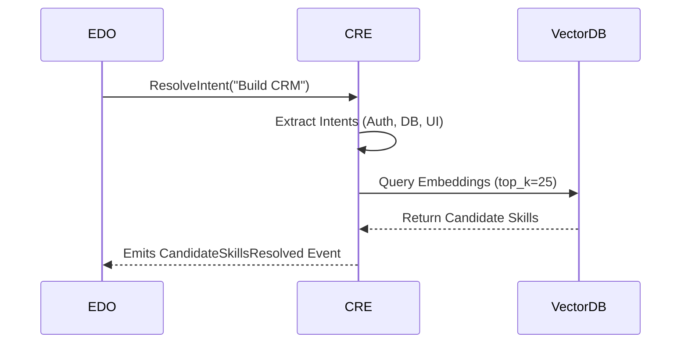

# Aetheris Core Architecture Specification (v1.0)

## 1. Architectural Philosophy & Overview
Aetheris operates as an **Engineering Operating System (EOS)**. It explicitly rejects the "code generator" paradigm. Instead, Aetheris enforces a rigid, un-bypassable workflow where engineering, documentation, and architecture must precede all implementation. The **Aetheris Brain Kernel** orchestrates 18 specialized, decoupled engines communicating exclusively via a unified Event Bus.

The primary goal of this architecture is to scale to an arbitrary number of skills (1500+) and external integrations without degrading runtime performance or creating tight vendor couplings.

---

## 2. Core Engines Specification

The 18 engines are organized into logical execution tiers: Decision, Intelligence, Workflow, Runtime, and Observation.

### 2.1 Executive Decision Orchestrator (EDO)
**Core Responsibility & State Ownership**
The EDO sits directly beneath the Brain Kernel. It is the final decision maker and **cannot be bypassed** by any LLM execution or user prompt bypass attempt. It owns the execution policies, workflow directives, and the overarching project configuration.

**Implementation Guidance**
- Implement as a Singleton or core daemon process that holds the primary Event Bus publisher lock.
- Use a State Machine (e.g., Python `transitions` library or a custom DAG executor) to ensure state transitions strictly follow `Planning -> Documentation -> Architecture -> Execution`.
- Must expose an `approve_action(action_request)` method that validates DoD (Definition of Done).

**Dependencies**
- Consumes events from the `EventBus`.
- Controls the `PEE` (Planning & Execution Engine) and `ROE` (Runtime Orchestrator).

**Risks & Mitigation**
- *Risk*: Single point of failure or bottleneck.
- *Mitigation*: The EDO should not do heavy compute. It should immediately delegate tasks via asynchronous events.

**Alternatives Considered**
- *Direct Brain Control*: Allowing the LLM to directly trigger executions. Rejected because it bypasses the strict engineering workflow requirements.

**Acceptance Criteria**
- No execution event can reach the `ROE` without an explicit approval signature from the `EDO`.
- Rejects any attempt to skip the Architecture or Documentation phases.

---

### 2.2 Repository Intelligence Engine (RIE)
**Core Responsibility & State Ownership**
Responsible for discovering and parsing all Skills, RFCs, SPECs, and Integrations within the repository. It owns the **Knowledge Graph** and **Dependency Graph**.

**Implementation Guidance**
- Utilize AST parsing and markdown scraping to recursively walk the `skills/`, `rfcs/`, `specs/`, and `integrations/` directories.
- Implement parallel file I/O to avoid blocking the main thread during indexing.
- Never hardcode counts; the engine must dynamically count and index discovered files.

**Dependencies**
- Emits graph data to the `CRE` and `CIE`.

**Risks & Mitigation**
- *Risk*: Extremely large repositories causing out-of-memory (OOM) errors during AST building.
- *Mitigation*: Stream data into an embedded SQLite database rather than holding the entire graph in RAM.

**Acceptance Criteria**
- Successfully parses 1500+ skills in under 5 seconds on a standard SSD.
- Exposes querying interfaces for capabilities and dependencies.

---

### 2.3 Capability Resolution Engine (CRE)
**Core Responsibility & State Ownership**
Converts raw textual prompts into concrete capabilities using semantic analysis. It owns the **Capability Index** and the execution of Embedding Models for search.

**Implementation Guidance**
- Implement the **3-Level Indexing** strategy: 
  1. **Intent Index**: Maps user prompt to broad intent (e.g., "UI").
  2. **Capability Index**: Maps intent to technical capability (e.g., "Authentication").
  3. **Skill Index**: Queries the Vector Database for matching skills.
- Use a lightweight embedding model (e.g., `all-MiniLM-L6-v2`) deployed locally via ONNX for zero-latency embeddings.

**Dependencies**
- Requires the unified Vector DB.
- Outputs candidates to the `SRE` (Skill Ranking Engine).

**Risks & Mitigation**
- *Risk*: Semantic drift where a prompt maps to the wrong capability.
- *Mitigation*: Fallback to keyword TF-IDF if vector similarity scores fall below a 0.75 threshold.

**Acceptance Criteria**
- Successfully maps vague intents to concrete capabilities with >90% precision.

---

### 2.4 Skill Ranking Engine (SRE)
**Core Responsibility & State Ownership**
Evaluates candidate skills returned by the CRE to determine the absolute best tools for the job. It owns the **Skill Scoring Matrix** and historical usage statistics.

**Implementation Guidance**
- Implement a weighted scoring algorithm utilizing:
  - `Confidence` (0.0 - 1.0)
  - `Previous Success Rate` (%)
  - `Compatibility` (Stack match)
  - `Execution Time` (ms)
  - `Quality Score` (derived from VRE)
- The engine must filter 25+ candidates down to the Top 5 without bias toward the skill's origin (Aetheris vs. ECC vs. Claude).

**Dependencies**
- Consumes Candidates from the `CRE`.
- Outputs Final Skills to the `RSE`.

**Acceptance Criteria**
- Deterministically ranks identical inputs consistently.
- Successfully penalizes skills with high historic failure rates.

---

### 2.5 Engineering Prediction Engine (EPE)
**Core Responsibility & State Ownership**
Anticipates required engineering phases and architecture needs based on the initial product discovery phase.

**Implementation Guidance**
- Implement a heuristic rule engine or a lightweight classification model that infers missing features.
- Example: If the project is "Uber clone", the EPE must automatically infer the need for Maps, Authentication, Realtime Tracking, and Payments.

**Acceptance Criteria**
- Given a 1-sentence prompt, generates a comprehensive dependency matrix of required subsystems.

---

### 2.6 Context Intelligence Engine (CIE)
**Core Responsibility & State Ownership**
Owns context. The CIE manages compression, ranking, retrieval, packing, and prompt building.

**Implementation Guidance**
- The CIE does **not** rely on Headroom as the owner of context; Headroom is merely one adapter that the CIE uses to compress data.
- Maintain a strict token budget matrix. Prevent context bloat by aggressively packing and truncating less relevant history based on cosine similarity to the current goal.

**Acceptance Criteria**
- Compresses a 200k token repository context down to the most relevant 30k tokens for the target capability.

---

### 2.7 Engineering Memory Engine (EME)
**Core Responsibility & State Ownership**
Stores structured memory, preventing repeating mistakes. It owns the **Memory Index** and **Decision Logs**.

**Implementation Guidance**
- Store Memory as discrete JSON entities with tags: `Decision`, `Rejected_Idea`, `Known_Bug`, `Lesson_Learned`, `Coding_Standard`.
- Expose a semantic search interface for the CIE to inject relevant memory into the prompt.

**Acceptance Criteria**
- Successfully retrieves a "Rejected Idea" from 3 months ago when a similar architectural pattern is proposed.

---

### 2.8 Documentation Orchestrator (DOE)
**Core Responsibility & State Ownership**
Centralized generator for all engineering documentation (PRD, BRD, RFC, Architecture, Roadmap). It owns the output Documentation AST.

**Implementation Guidance**
- Must output Markdown adhering to the Aetheris documentation templates.
- Enforce the "Implementation-Grade" rule: Documents must be >2 pages, containing Mermaid diagrams, risks, and rationales.

**Acceptance Criteria**
- Generates exhaustive, interconnected markdown files without summary-level fluff.

---

### 2.9 Architecture Intelligence Engine (AIE)
**Core Responsibility & State Ownership**
Determines system patterns, cloud topologies, and structural foundations.

**Implementation Guidance**
- Generates structured architecture blueprints based on the EPE's predictions. Outputs C4 Model diagrams using Mermaid.

---

### 2.10 Design Intelligence Engine (DIE)
**Core Responsibility & State Ownership**
Owns the design system. Generates Brand, Color Theory, Accessibility, Motion, Typography, Spacing, and Component logic.

**Implementation Guidance**
- Outputs design tokens (JSON/CSS) that can be consumed agnostically by React, Flutter, HTML, or Next.js.
- Must generate both Dark and Light mode variants natively.

---

### 2.11 Planning & Execution Engine (PEE)
**Core Responsibility & State Ownership**
Translates raw business goals and architectures into executable, atomic Task DAGs.

**Implementation Guidance**
- Output must be a directed acyclic graph (DAG) of dependencies to feed into the Runtime Scheduler.

---

### 2.12 Runtime Scheduler (RSE)
**Core Responsibility & State Ownership**
The queue manager. Determines parallel vs sequential execution, retry policies, and timeouts. It owns the **Execution Queue** and **Worker State**.

**Implementation Guidance**
- Implement an async event loop (e.g., `asyncio` Task Groups) to dispatch skills.
- Handle cancellation tokens for hung tasks.

**Acceptance Criteria**
- Safely cancels skills that exceed their configured execution timeout.
- Successfully executes non-dependent skills in parallel.

---

### 2.13 Runtime Orchestrator (ROE)
**Core Responsibility & State Ownership**
Handles the sandboxed execution of scheduled tasks and integration adapters. It owns the isolated runtime environment state.

**Implementation Guidance**
- Wrap execution in Docker containers, restricted namespaces, or strict PySandbox environments to prevent arbitrary code execution vulnerabilities.

---

### 2.14 Verification & Review Engine (VRE)
**Core Responsibility & State Ownership**
Validates outputs against the PRD and DoD. Rejects placeholders, fake progress, and hardcoded values.

**Implementation Guidance**
- Utilize AST analysis to detect `TODO`, `pass`, or mock data inside generated code.
- Run test suites (pytest/jest) and capture exit codes.

---

### 2.15 Project State Engine (PSE)
**Core Responsibility & State Ownership**
Tracks live state: Current sprint, milestone, completed tasks, and risks. Different from EME (which is historical memory).

**Implementation Guidance**
- Maintain a highly volatile JSON state file reflecting live progress across the DAG.

---

### 2.16 Model Intelligence Engine (MIE)
**Core Responsibility & State Ownership**
Dynamically selects the optimal LLM based on the capability.

**Implementation Guidance**
- Route requests via a unified API gateway (e.g., LiteLLM).
- *Routing Logic*: Architecture -> Claude 3.5 Sonnet; Fast JSON -> Local Model; Vision -> Gemini 1.5 Pro.

---

### 2.17 Integration Manager (IM)
**Core Responsibility & State Ownership**
Plugin registry and adapter loader.

**Implementation Guidance**
- Use dynamic module loading (`importlib`) to load Headroom, ECC, OpenHands, etc., without hardcoding.

---

### 2.18 Observability Engine (OE)
**Core Responsibility & State Ownership**
Tracks metrics, traces, execution time, token usage, latency.

**Implementation Guidance**
- Instrument all engines using OpenTelemetry standards.
- Export traces to a local SQLite or Jaeger instance.
