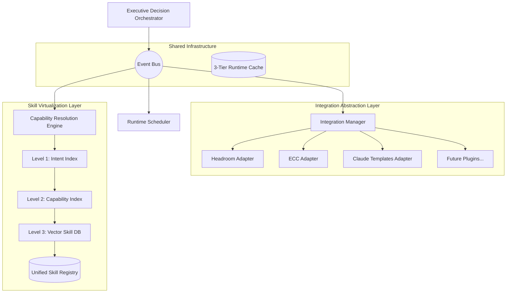

# Aetheris System Integration & Virtualization Architecture

## 1. System Topology Overview

The Aetheris Engineering Operating System requires strict decoupling of external tools and a unified abstraction layer for skills. This document specifies the implementation requirements for the Integration Abstraction Layer, the Skill Virtualization Layer, and the Shared Infrastructure.



---

## 2. Integration Abstraction Layer

**Core Responsibility**
Prevents Aetheris from becoming tightly coupled to third-party tools like Headroom, Everything Claude Code (ECC), OpenHands, or Goose. Adding a new tool must only require registering a plugin.

**Implementation Guidance**
- **Plugin Registry**: Define a `PluginManifest.json` schema. The `IntegrationManager` reads these manifests at boot.
- **Adapter Base Class**: 
  ```python
  class IntegrationAdapter(ABC):
      @abstractmethod
      def load(self, config): pass
      @abstractmethod
      def execute(self, payload): pass
  ```
- **Headroom Adapter**: Wraps Headroom's context compression API. Exposes standard `compress()` and `rank()` functions.
- **ECC Adapter**: Wraps ECC workflows. Converts ECC hooks into Aetheris Event Bus messages.

**Risks & Mitigation**
- *Risk*: Third-party API changes breaking the runtime.
- *Mitigation*: The Adapter must catch all external exceptions and return a standardized `IntegrationError` event, allowing the `RSE` to retry or fail gracefully.

**Acceptance Criteria**
- A new tool can be added to the system by dropping a Python adapter file into the `plugins/` directory and restarting the runtime, without altering core Aetheris code.

---

## 3. Skill Virtualization Layer (3-Level Indexing)

**Core Responsibility**
Manage, search, and rank 1500+ skills from various repositories (Aetheris native, ECC, Claude Templates) in O(1) or O(log N) time.

**Implementation Guidance**
- **Level 1 (Intent Index)**: A lightweight mapping of conversational intents to rigid domains.
  - *Example*: User says "Make a button" -> Intent: `FRONTEND_UI`.
- **Level 2 (Capability Index)**: Maps domains to required technical capabilities.
  - *Example*: `FRONTEND_UI` -> `[ComponentDesign, CSSStyling, Accessibility]`.
- **Level 3 (Skill Vector DB)**: 
  - Provision a local Vector Database (e.g., ChromaDB or LanceDB).
  - Embed every skill's `SKILL.md` description.
  - Perform Cosine Similarity search against the capabilities.
  - Return a unified `VirtualSkill` object that masks the origin repository.

**Risks & Mitigation**
- *Risk*: Vector search latency impacting the critical path.
- *Mitigation*: Cache frequent embeddings using the 3-Tier Runtime Cache.

**Acceptance Criteria**
- Can search across 1500 simulated skills and return the Top 25 candidates in under 50ms.

---

## 4. 3-Tier Runtime Cache

**Core Responsibility**
Prevent the system from loading 1500 skills into RAM simultaneously.

**Implementation Guidance**
- **Hot Cache**: In-memory (Dict/Redis). Holds the top 50 most frequently used skills globally, plus any skill used in the current execution DAG.
- **Warm Cache**: Local disk SSD (SQLite/JSON). Holds the metadata of the top 500 skills.
- **Cold Storage**: The raw file system (`SKILL.md` files).

**Acceptance Criteria**
- The runtime consumes less than 200MB of RAM at idle while managing 1500 skills.

---

## 5. Event Bus Specifications

**Core Responsibility**
Provide the asynchronous communication backbone.

**Implementation Guidance**
- Event Schema:
  ```json
  {
    "id": "uuid4",
    "type": "CAPABILITY_RESOLVED",
    "source_engine": "CRE",
    "timestamp": 171830200,
    "payload": {
      "intent": "Auth",
      "candidates": ["skill_1", "skill_2"]
    }
  }
  ```
- Use Python's `asyncio.Queue` for in-memory message brokering.

**Acceptance Criteria**
- Engines can publish and subscribe to events without direct object references to other engines.
