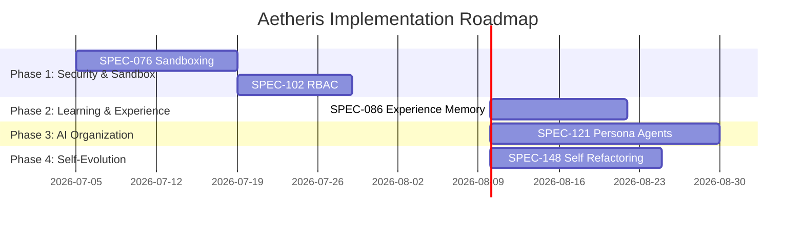

# Aetheris Improvement Plan Roadmap

This roadmap details the sequential tasks required to implement the missing modules of Aetheris.

## Roadmap Phases

## Detailed Work Item Attributions
| Work Item | Subsystem | Estimated Effort | Risk | Expected Gain |
|---|---|---|---|---|
| implement Sandboxing | Runtime | 14 days | High | Safe, isolated project executions |
| Implement RBAC | Enterprise | 10 days | Medium | Tenant isolation and credentials privacy |
| Implement EME | Learning | 12 days | Medium | Replayable execution memory across tasks |
| Implement Specialist Agents | AI Organization | 20 days | High | Decoupled, specialized persona workflows |
| Implement AST Refactoring | Self-Evolution | 15 days | High | Autonomous code optimization and repairs |
