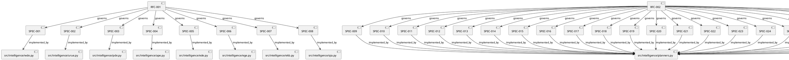

# dependency_graph

```plantuml
@startuml
[RFC-001] --> [SPEC-001] : governs
[SPEC-001] --> [src/intelligence/wde.py] : implemented_by
[RFC-001] --> [SPEC-002] : governs
[SPEC-002] --> [src/intelligence/urue.py] : implemented_by
[RFC-001] --> [SPEC-003] : governs
[SPEC-003] --> [src/intelligence/pde.py] : implemented_by
[RFC-001] --> [SPEC-004] : governs
[SPEC-004] --> [src/intelligence/ape.py] : implemented_by
[RFC-001] --> [SPEC-005] : governs
[SPEC-005] --> [src/intelligence/ede.py] : implemented_by
[RFC-001] --> [SPEC-006] : governs
[SPEC-006] --> [src/intelligence/ege.py] : implemented_by
[RFC-001] --> [SPEC-007] : governs
[SPEC-007] --> [src/intelligence/ekb.py] : implemented_by
[RFC-001] --> [SPEC-008] : governs
[SPEC-008] --> [src/intelligence/qia.py] : implemented_by
[RFC-002] --> [SPEC-009] : governs
[SPEC-009] --> [src/intelligence/planners.py] : implemented_by
[RFC-002] --> [SPEC-010] : governs
[SPEC-010] --> [src/intelligence/planners.py] : implemented_by
[RFC-002] --> [SPEC-011] : governs
[SPEC-011] --> [src/intelligence/planners.py] : implemented_by
[RFC-002] --> [SPEC-012] : governs
[SPEC-012] --> [src/intelligence/planners.py] : implemented_by
[RFC-002] --> [SPEC-013] : governs
[SPEC-013] --> [src/intelligence/planners.py] : implemented_by
[RFC-002] --> [SPEC-014] : governs
[SPEC-014] --> [src/intelligence/planners.py] : implemented_by
[RFC-002] --> [SPEC-015] : governs
[SPEC-015] --> [src/intelligence/planners.py] : implemented_by
[RFC-002] --> [SPEC-016] : governs
[SPEC-016] --> [src/intelligence/planners.py] : implemented_by
[RFC-002] --> [SPEC-017] : governs
[SPEC-017] --> [src/intelligence/planners.py] : implemented_by
[RFC-002] --> [SPEC-018] : governs
[SPEC-018] --> [src/intelligence/planners.py] : implemented_by
[RFC-002] --> [SPEC-019] : governs
[SPEC-019] --> [src/intelligence/planners.py] : implemented_by
[RFC-002] --> [SPEC-020] : governs
[SPEC-020] --> [src/intelligence/planners.py] : implemented_by
[RFC-002] --> [SPEC-021] : governs
[SPEC-021] --> [src/intelligence/planners.py] : implemented_by
[RFC-002] --> [SPEC-022] : governs
[SPEC-022] --> [src/intelligence/planners.py] : implemented_by
[RFC-002] --> [SPEC-023] : governs
[SPEC-023] --> [src/intelligence/planners.py] : implemented_by
[RFC-002] --> [SPEC-024] : governs
[SPEC-024] --> [src/intelligence/planners.py] : implemented_by
[RFC-002] --> [SPEC-025] : governs
[SPEC-025] --> [src/intelligence/planners.py] : implemented_by
[RFC-002] --> [SPEC-026] : governs
[SPEC-026] --> [src/intelligence/planners.py] : implemented_by
[RFC-002] --> [SPEC-027] : governs
[SPEC-027] --> [src/intelligence/planners.py] : implemented_by
[RFC-002] --> [SPEC-028] : governs
[SPEC-028] --> [src/intelligence/planners.py] : implemented_by
[RFC-002] --> [SPEC-029] : governs
[SPEC-029] --> [src/intelligence/planners.py] : implemented_by
[RFC-002] --> [SPEC-030] : governs
[SPEC-030] --> [src/intelligence/planners.py] : implemented_by
[RFC-002] --> [SPEC-031] : governs
[SPEC-031] --> [src/intelligence/planners.py] : implemented_by
[RFC-003] --> [SPEC-032] : governs
[SPEC-032] --> [src/execution/tde.py] : implemented_by
[RFC-003] --> [SPEC-033] : governs
[SPEC-033] --> [src/execution/dgb.py] : implemented_by
[RFC-003] --> [SPEC-034] : governs
[SPEC-034] --> [src/execution/sse.py] : implemented_by
[RFC-003] --> [SPEC-035] : governs
[SPEC-035] --> [src/execution/mre.py] : implemented_by
[RFC-003] --> [SPEC-036] : governs
[SPEC-036] --> [src/execution/cae.py] : implemented_by
[RFC-003] --> [SPEC-037] : governs
[SPEC-037] --> [src/execution/es.py] : implemented_by
[RFC-003] --> [SPEC-038] : governs
[SPEC-038] --> [src/execution/pee.py] : implemented_by
[RFC-003] --> [SPEC-039] : governs
[SPEC-039] --> [src/execution/acge.py] : implemented_by
[RFC-003] --> [SPEC-040] : governs
[SPEC-040] --> [src/execution/sre.py] : implemented_by
@enduml
```
