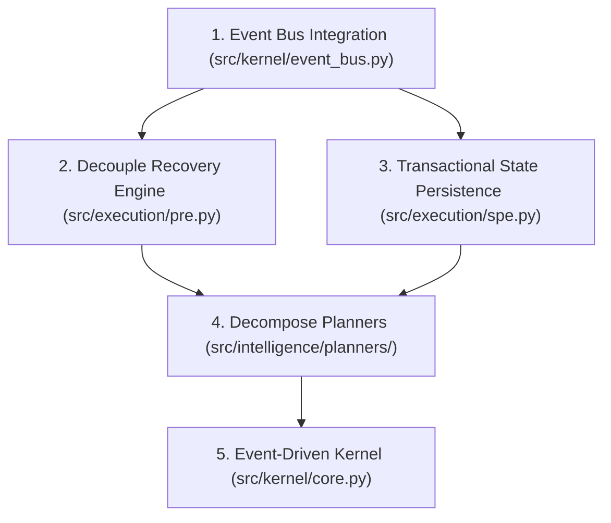

# AETHERIS MASTER ARCHITECTURE REVIEW BOOK (v2.0)

**Audit Date:** 2026-07-01 20:20:28
**Zero Data Loss Policy:** ENFORCED
**Verdict:** CONDITIONAL APPROVAL

---

# PASS 19 — ARCHITECTURE REFACTORING PLAN

To transition Aetheris to V1.0 Production Readiness, the following Modernization Sprint Plan must be executed.

## 1. Refactoring Sequence (Dependency-Driven)
The refactoring must proceed in reverse dependency order to prevent cascading integration failures:

## 2. Refactoring Phases

### Phase 1: Core Event Bus & Resilient Persistence (Week 1)
* **Goal:** Establish atomic locks on states and verify event handling.
* **Rollback Plan:** Maintain backups of `execution_state.json` via file rotation.
* **Success Checkpoint:** Run concurrent execution stress tests with 10 threads. Zero file corruptions.

### Phase 2: Decouple Recovery & Planning Layers (Week 2)
* **Goal:** Eliminate all `intelligence` imports from `src/execution/pre.py`.
* **Rollback Plan:** Git branch rollback to `stable-pre-event`.
* **Success Checkpoint:** Static import boundary checks verify zero execution-to-planning imports.

### Phase 3: Planner Monolith Decomposition (Week 3)
* **Goal:** Split `planners.py` into 21 files.
* **Rollback Plan:** Keep `planners.py` in legacy package directory until integration is fully verified.
* **Success Checkpoint:** All 60 unit tests pass.

---
