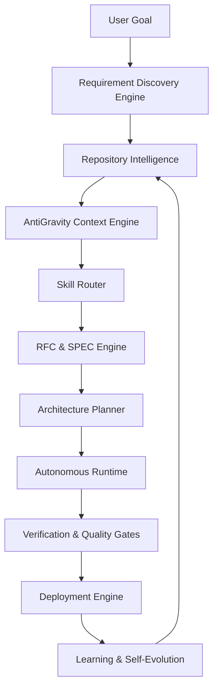

<div align="center">

# ⚙️ Aetheris

### The AI Engineering Operating System

**Repository-Aware · Architecture-First · Specification-Driven · Production-Grade**

Aetheris transforms any LLM into an autonomous software engineering organization. It does not generate code from prompts — it performs structured, repository-aware engineering governed by RFCs, SPECs, 247 skills, and an Architecture Review Board, producing production-ready software from requirements to deployment.

---

[](https://github.com/Heer-Patel69/Aetheris/releases)
[](https://python.org)
[](./LICENSE)
[]()
[]()
[](./docs/rfcs/)
[](./docs/specs/)
[](./docs/skills/)
[]()
[](./docs/)

</div>

---

## Installation

Installation is a single command. No virtual environment setup. No manual dependency resolution.

```bash
pip install aetheris
```

#### Supported Platforms

| Platform | Method | Command |
|----------|--------|---------|
| **Windows** | pip | `pip install aetheris` |
| **Linux** | pip | `pip install aetheris` |
| **macOS** | pip / brew | `pip install aetheris` |
| **Docker** | image | `docker pull aetheris/aetheris:latest` |

#### Verify & Initialize

```bash
# Verify installation
aetheris --version

# Initialize a new workspace
aetheris init

# Analyze an existing repository
aetheris analyze

# Build software from a goal
aetheris build

# Launch the engineering dashboard
aetheris dashboard

# Deploy to production
aetheris deploy
```

---

## Quick Start

Engineer production-grade software in under two minutes.

```bash
# 1. Initialize a new project
aetheris init my-saas-app
cd my-saas-app

# 2. Describe what you want to build
aetheris --goal "Build a multi-tenant SaaS platform with authentication,
  subscription billing, REST API, PostgreSQL, Redis, and Docker deployment"

# Aetheris will:
#   - Discover requirements
#   - Build repository knowledge graph
#   - Generate architecture and RFCs
#   - Select and execute 247 skills
#   - Implement backend, frontend, database, security
#   - Write tests, documentation, and deployment pipeline
#   - Run quality gates and produce a production readiness report
```

```bash
# Analyze an existing project
cd /path/to/existing-project
aetheris analyze

# Understand what was built
aetheris dashboard

# Add a feature to an existing codebase
aetheris --goal "Add Stripe payment integration with webhook handling and retry logic"
```

---

## What is Aetheris?

Aetheris is an **AI Engineering Operating System** — not an AI coding assistant.

The distinction matters. A coding assistant responds to prompts. Aetheris operates as an autonomous engineering organization: it discovers requirements, designs architecture, selects relevant engineering skills, generates RFCs and SPECs, implements production-grade code, runs security and quality audits, writes documentation, and ships to production — all governed by a structured, traceable engineering process.

| Dimension | AI Coding Assistant | Aetheris |
|-----------|--------------------|---------:|
| Input | Prompt | Goal |
| Planning | None | Full lifecycle planning |
| Architecture | None | RFC-driven architecture |
| Repository Awareness | None | Full knowledge graph |
| Context Optimization | None | AntiGravity engine |
| Skills | Implicit | 247 explicit, routed skills |
| Testing | Optional | Built-in, mandatory |
| Security | Optional | Built-in, mandatory |
| Documentation | Optional | Auto-generated |
| Deployment | None | Full pipeline |
| Learning | None | Self-evolution |

Aetheris is designed for teams and engineers who need software that meets production standards from the first commit — not prototypes that require rewrites.

---

## Why Aetheris?

Every LLM-based engineering tool faces the same fundamental problems. Aetheris is built to eliminate them.

| Problem | Impact | Aetheris Solution |
|---------|--------|------------------|
| **Prompt engineering limitations** | Poor requirements, missing features | Automated Requirement Discovery Engine |
| **Repository blindness** | Generates code incompatible with existing architecture | Full repository scan and knowledge graph |
| **No planning** | Disconnected, inconsistent components | Product Intelligence and task DAG compiler |
| **No architecture** | Unmaintainable, unscalable systems | RFC-driven architecture design before any code |
| **Missing backend** | Frontend-only output | Capability Discovery ensures all layers are built |
| **No testing** | Untested, broken code ships | Mandatory unit, integration, and E2E test generation |
| **No security** | Vulnerabilities ship to production | Built-in threat modeling, OWASP patterns, audit |
| **No documentation** | Orphaned code | Auto-generated inline docs, API docs, architecture diagrams |
| **Engineering inconsistency** | Style drift, pattern conflicts | SPEC contracts enforce consistency across every task |
| **Context explosion** | Token limits hit on large codebases | AntiGravity compresses repository context by 90%+ |

---

## Core Architecture

Aetheris is composed of eight interconnected subsystems.



| Subsystem | Responsibility |
|-----------|---------------|
| **Kernel** | Core orchestration, task DAG compilation, execution lifecycle |
| **AntiGravity** | Context compression, semantic retrieval, token budget management |
| **Repository Intelligence** | Knowledge graph, dependency map, capability inventory, traceability |
| **Memory** | Engineering decision history, project state, cross-session continuity |
| **Learning** | Records outcomes, improves skill routing, refines context selection |
| **Verification** | Quality gates, Definition of Done audits, ARB compliance checks |
| **Runtime** | Sandboxed autonomous execution, error recovery, audit logging |
| **Organization** | AI persona layer — CEO, CTO, Architect, Developer, QA, Security agents |
| **Enterprise** | RBAC, multi-tenancy, audit trails, compliance reporting, air-gapped support |
| **Evolution** | Self-refactoring, architecture review, regression-safe code improvement |

---

## Engineering Workflow

Aetheris follows a deterministic, traceable engineering lifecycle for every goal.

```mermaid
graph LR
    A[Requirements] --> B[Capability Discovery]
    B --> C[Repository Discovery]
    C --> D[Skill Discovery]
    D --> E[RFC Selection]
    E --> F[SPEC Selection]
    F --> G[Architecture Design]
    G --> H[Implementation]
    H --> I[Testing & Security]
    I --> J[Documentation]
    J --> K[Deployment]
    K --> L[Verification & Benchmark]
    L --> M[Production]
```



| Phase | What Happens |
|-------|-------------|
| **Requirements** | Extracts business rules, user stories, constraints, and non-functional requirements from the goal |
| **Capability Discovery** | Identifies what needs to be built: APIs, services, databases, UI, infrastructure |
| **Repository Discovery** | Scans existing codebase to understand what already exists |
| **Skill Discovery** | Routes 247 skills to the tasks that need them |
| **RFC Selection** | Selects and applies relevant architecture decision records |
| **SPEC Selection** | Selects engineering contracts governing implementation quality |
| **Architecture Design** | Designs layered system architecture before writing code |
| **Implementation** | Executes engineering tasks in dependency order |
| **Testing & Security** | Generates tests, runs security audit, validates coverage |
| **Documentation** | Produces API docs, architecture diagrams, developer guides |
| **Deployment** | Creates Dockerfiles, manifests, CI/CD pipelines |
| **Verification** | Runs Definition of Done audit, benchmarks quality score |
| **Production** | Delivers production-ready system with full traceability |

---

## Features

| Feature | Description |
|---------|-------------|
| **Repository Intelligence** | Full codebase scan, knowledge graph, dependency map, capability inventory, traceability matrix |
| **AntiGravity** | 90%+ context compression via semantic retrieval, skill routing, and token budget allocation |
| **Engineering Planning** | Product intelligence, task DAG compilation, prioritization, milestone tracking |
| **247 Skills** | Modular, routed engineering capabilities across 16 departments |
| **RFC System (17 RFCs)** | Architecture decision records governing system design |
| **SPEC System (170 SPECs)** | Engineering contracts governing implementation quality |
| **CLI** | Full-featured command-line interface for all engineering operations |
| **Dashboard** | Real-time engineering metrics, architecture visualization, quality gate status |
| **Benchmarking** | Automated quality scoring across 6 dimensions: completeness, security, tests, docs, performance, deployment |
| **Verification** | Definition of Done audits, ARB compliance, production readiness scoring |
| **Self Evolution** | Architecture review, automated refactoring, regression-safe improvement |
| **Enterprise Support** | RBAC, multi-tenancy, LDAP/SAML, audit logging, air-gapped deployment |
| **AI Organization** | Multi-agent persona layer: CEO, CTO, Architect, Developer, QA, Security, DevOps |
| **Memory Engine** | Cross-session project state, decision history, engineering continuity |
| **Security Engine** | OWASP patterns, threat modeling, secret detection, CVE scanning, compliance |
| **Deployment Engine** | Docker, Kubernetes, Terraform, CI/CD pipelines, rollback strategies |

---

## Skills, RFCs & SPECs

Aetheris's engineering quality comes from three interlocking systems.

### Skills

Skills are modular, self-contained engineering capabilities written in Markdown. Each skill defines what it does, when it activates, what it depends on, and how to measure its success.

- **247 skills** across 16 departments
- Skills are routed dynamically based on task context
- Skills can be chained, composed, and inherited
- Custom skills can be added by teams and published to the marketplace

→ [Skills Documentation](./docs/skills/)

### RFCs (Request for Comments)

RFCs are architecture decision records that govern how Aetheris designs systems. Before writing code, Aetheris selects the relevant RFCs for the project and applies their architectural guidance.

- **17 RFCs** covering kernel, runtime, planning, memory, security, deployment, and more
- RFCs are versioned, traceable, and linked to every engineering decision
- Teams can author and enforce custom RFCs

→ [RFC Documentation](./docs/rfcs/)

### SPECs (Specifications)

SPECs are engineering contracts. Every task executed by Aetheris is governed by one or more SPECs that define quality criteria, acceptance requirements, and implementation standards.

- **170 SPECs** covering every phase of the engineering lifecycle
- SPECs enforce consistency across the entire codebase
- SPECs are audited at the end of every execution

→ [SPEC Documentation](./docs/specs/)

---

## CLI & Dashboard

### CLI Reference

```bash
aetheris --version          # Display version
aetheris init [name]        # Initialize new workspace
aetheris analyze            # Scan and analyze repository
aetheris --goal "<text>"    # Engineer software from a goal
aetheris build              # Execute engineering pipeline
aetheris dashboard          # Launch engineering dashboard (localhost:8080)
aetheris deploy             # Deploy to production
aetheris doctor             # Validate installation and environment
aetheris skills             # List available skills
aetheris benchmark          # Run quality benchmark
aetheris docs               # Generate documentation
aetheris search "<query>"   # Semantic search across repository
```

### Dashboard

The Aetheris dashboard provides real-time visibility into every engineering operation.

| Panel | Description |
|-------|-------------|
| **Engineering Metrics** | Task execution status, skill usage, token consumption |
| **Architecture View** | Interactive system diagram, dependency graph |
| **Quality Gates** | Test coverage, security audit, SPEC compliance |
| **Production Readiness** | Composite score across 6 quality dimensions |
| **Benchmark History** | Quality trend over time, delta from baseline |
| **Drift Detection** | Alerts when implementation diverges from architecture |

```bash
# Start dashboard
aetheris dashboard

# Opens browser at http://localhost:8080
```

---

## Project Structure

```
aetheris/
├── src/                    # Core source code
│   └── kernel/             # Kernel, runtime, orchestration
├── skills/                 # 247 engineering skills (Markdown)
├── rfcs/                   # 17 architecture decision records
├── docs/                   # Full documentation
│   ├── rfcs/               # RFC handbook
│   ├── specs/              # SPEC handbook
│   ├── skills/             # Skills handbook
│   ├── architecture/       # Architecture guides
│   └── api/                # API reference
├── architecture/           # Architecture diagrams and models
├── contracts/              # Engineering contracts
├── config/                 # Configuration schemas and defaults
├── schemas/                # JSON schemas for all Aetheris artifacts
├── tests/                  # Test suite
├── benchmarks/             # Benchmark definitions and results
├── verification/           # Quality gate scripts
├── walkthroughs/           # Step-by-step engineering walkthroughs
├── adrs/                   # Architecture Decision Records
├── 00_SYSTEM_CONSTITUTION.md  # Master engineering operating policy
├── pyproject.toml          # Package manifest
└── VERSION                 # Current version
```

---

## Documentation

| Document | Description |
|----------|-------------|
| [Architecture Overview](./docs/architecture/) | System design, subsystems, component diagrams |
| [Installation Guide](./docs/installation.md) | Full installation for all platforms and environments |
| [CLI Reference](./docs/cli.md) | Every command, flag, and example |
| [RFC Handbook](./docs/rfcs/) | All 17 RFCs with purpose, scope, and examples |
| [SPEC Handbook](./docs/specs/) | All 170 SPECs with contracts and acceptance criteria |
| [Skills Handbook](./docs/skills/) | All 247 skills with routing rules and examples |
| [Developer Guide](./docs/developer-guide.md) | Contributing, extending, and customizing Aetheris |
| [Security Guide](./docs/security.md) | Security architecture, threat model, compliance |
| [Deployment Guide](./docs/deployment.md) | Docker, Kubernetes, CI/CD, cloud deployment |
| [API Reference](./docs/api/) | Full API documentation |
| [Contributing Guide](./CONTRIBUTING.md) | How to contribute skills, RFCs, SPECs, and code |
| [System Constitution](./00_SYSTEM_CONSTITUTION.md) | Master engineering operating policy |

---

## Examples

```bash
# Build a multi-tenant SaaS platform
aetheris --goal "Build a SaaS platform with multi-tenancy, subscription billing,
  Stripe integration, admin dashboard, REST API, PostgreSQL, and Docker deployment"

# Build a production website
aetheris --goal "Build a marketing website with blog, contact form, SEO optimization,
  Next.js, Tailwind CSS, and Vercel deployment"

# Build a CRM system
aetheris --goal "Build a CRM with lead management, pipeline tracking, email integration,
  reporting dashboards, and role-based access control"

# Build an AI agent
aetheris --goal "Build an autonomous AI research agent with web search, memory,
  RAG pipeline, vector database, and REST API"

# Build a mobile app backend
aetheris --goal "Build a mobile app backend with user authentication, push notifications,
  real-time WebSocket, file uploads, and horizontal scaling"

# Build an analytics dashboard
aetheris --goal "Build a business intelligence dashboard with data ingestion,
  ETL pipeline, PostgreSQL, Chart.js visualizations, and PDF export"

# Build an enterprise ERP
aetheris --goal "Build an ERP system with inventory management, purchase orders,
  invoicing, multi-currency support, and audit logging"
```

---

## Roadmap

| Milestone | Feature | Status |
|-----------|---------|--------|
| **v3.2** | VS Code Extension — inline engineering inside the editor | Planned |
| **v3.2** | JetBrains Plugin — full Aetheris integration in IntelliJ | Planned |
| **v3.3** | Aetheris Cloud — managed cloud execution with team collaboration | In Design |
| **v3.3** | GUI Desktop App — native desktop interface for Windows, macOS, Linux | In Design |
| **v3.4** | Skill Marketplace — publish, download, and share skills | Planned |
| **v3.4** | Plugin System — first-class extension API for third-party integrations | Planned |
| **v3.5** | Enterprise Cloud — private cloud deployment with RBAC, SSO, audit | Planned |
| **v4.0** | GitHub App — trigger Aetheris engineering from GitHub issues and PRs | Research |
| **v4.0** | Autonomous Self-Evolution — Aetheris improves its own architecture | Research |
| **v4.1** | Multi-Model Routing — route tasks to specialized models per domain | Research |

---

## Community & License

### Community

| Channel | Link |
|---------|------|
| **GitHub** | [github.com/Heer-Patel69/Aetheris](https://github.com/Heer-Patel69/Aetheris) |
| **Issues** | [Report a bug or request a feature](https://github.com/Heer-Patel69/Aetheris/issues) |
| **Discussions** | [Architecture discussions, Q&A, RFCs](https://github.com/Heer-Patel69/Aetheris/discussions) |
| **Contributing** | [How to contribute](./CONTRIBUTING.md) |
| **Documentation** | [Full documentation](./docs/) |

### Contributing

Aetheris welcomes contributions across all layers:

- **Skills** — Add new engineering capabilities in `/skills/`
- **RFCs** — Propose architecture changes via RFC process
- **SPECs** — Improve engineering contracts in `/contracts/`
- **Code** — Core kernel, runtime, and subsystem improvements
- **Documentation** — Guides, examples, translations

See [CONTRIBUTING.md](./CONTRIBUTING.md) for the full contribution process.

### License

Aetheris is released under the [MIT License](./LICENSE).

```
MIT License — Free to use, modify, and distribute.
Copyright (c) 2024 Aetheris Contributors
```

---

<div align="center">

**Aetheris** — Engineering software the way it should be engineered.

[Documentation](./docs/) · [RFCs](./docs/rfcs/) · [SPECs](./docs/specs/) · [Skills](./docs/skills/) · [Contributing](./CONTRIBUTING.md)

</div>
