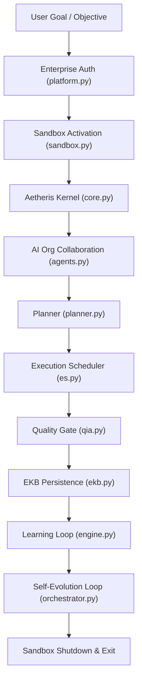
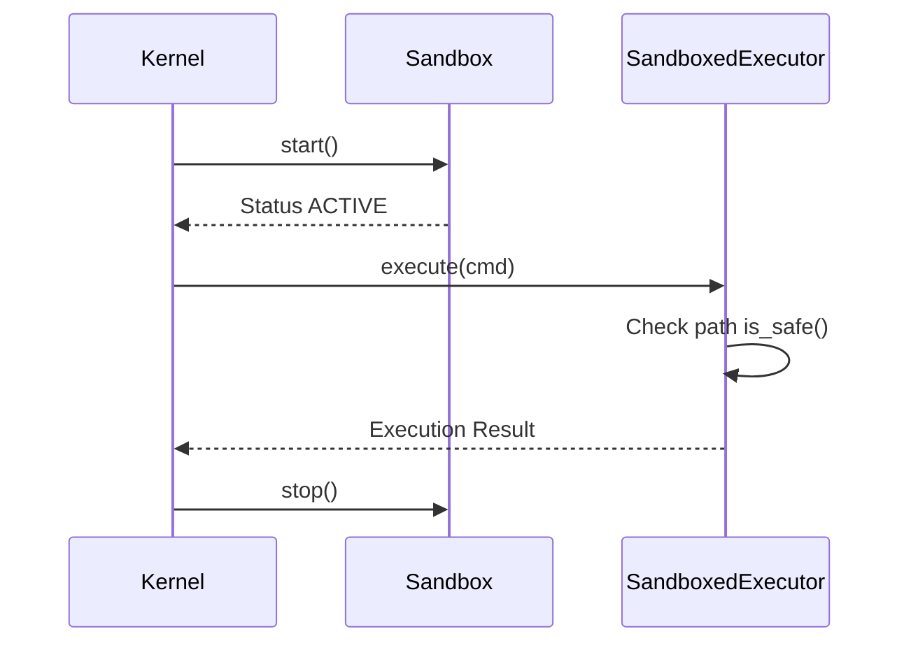

# Aetheris System Architecture Diagrams

This document contains Mermaid sources representing the system architecture.

## 1. Overall Component Architecture

## 2. Sequence Diagram: Sandbox Execution

