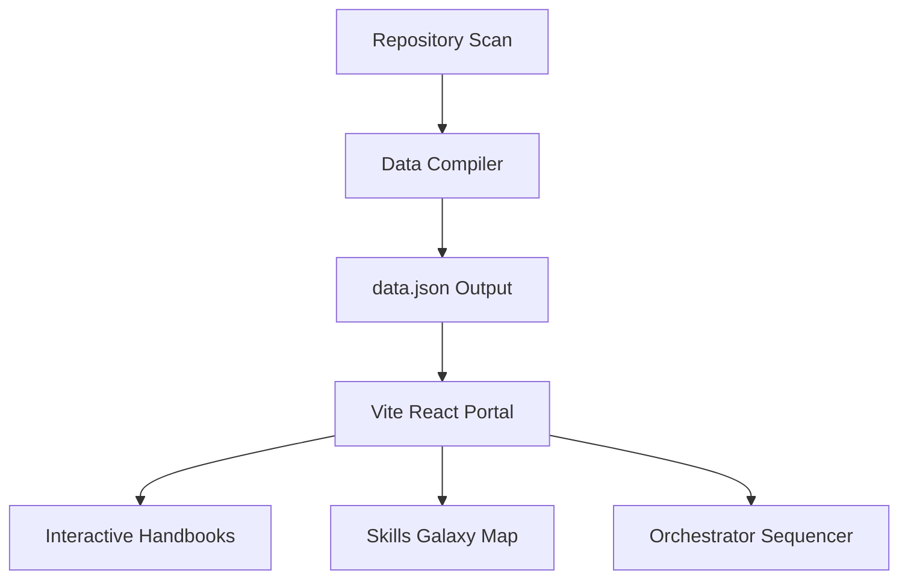
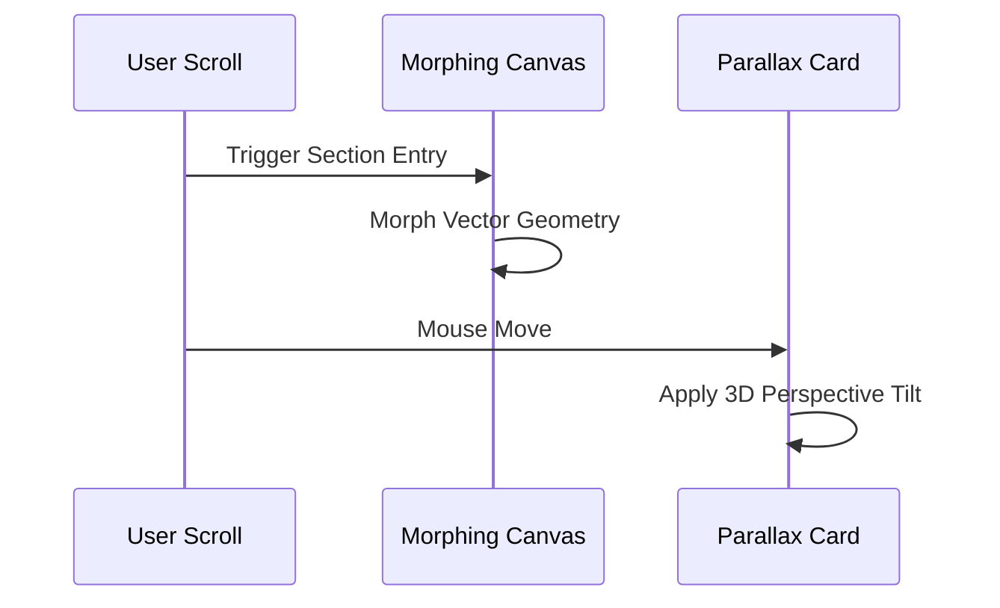
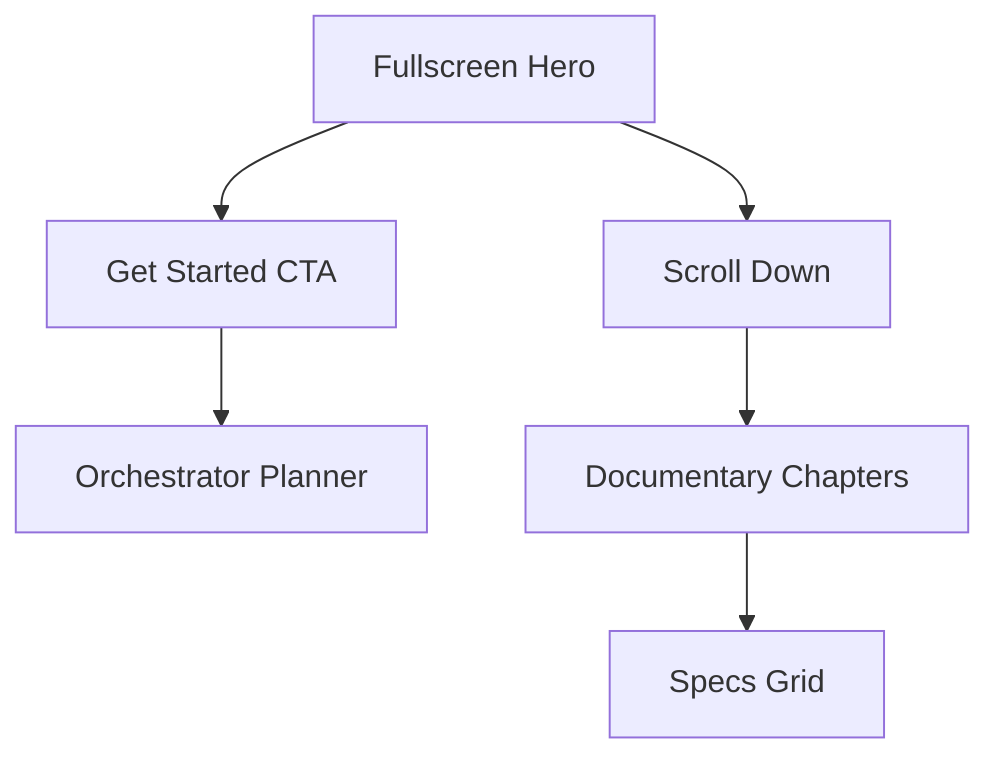
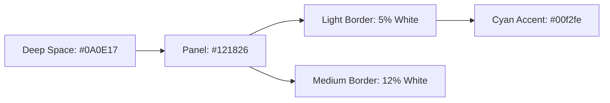
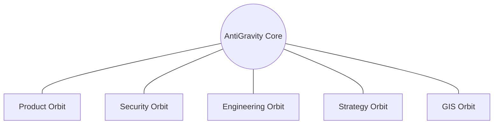
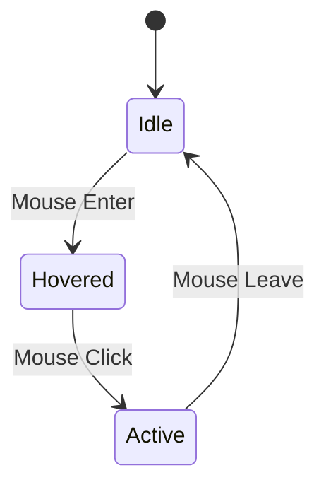
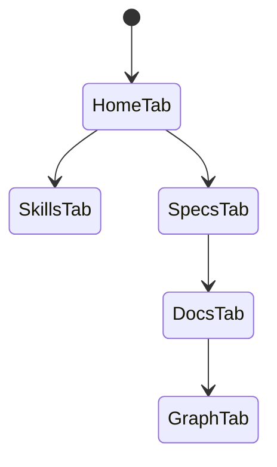

# Aetheris Website Master Prompt & Engineering Handbook (Extended Edition)

Welcome to the official **Aetheris Website Engineering Handbook**. This document serves as the canonical specification and master prompt for designing, developing, deploying, and maintaining the Aetheris AI Operating System website.

---

## Section 1: Product Vision

### 1.1 Goals & Mission
The Aetheris AI Operating System website is a production-grade documentation, exploration, and planning portal. It exists to provide engineering clarity and visibility into the Aetheris Kernel core. The portal must present exhaustive, production-grade engineering specifications, code modules, and architectural blueprints with zero shortcuts.

### 1.2 Responsibilities & Authority
* **Chief Software Architect**: Establishes directory perimeters, coding conventions, and sandbox boundaries.
* **Product Manager**: Governs feature matrices, user stories, and acceptance criteria.
* **Quality Assurance Lead**: Enforces compliance checks for all specifications.

### 1.3 System Architecture
The platform is organized into three distinct operational layers:
1. **Repository Ingest Engine**: Parses RFC documents, specialist declarations, and compliance tests.
2. **Client Data Portal**: Serves interactive documentation, dependency graphs, and planetary skill maps.
3. **Execution Sandbox**: Runs the AntiGravity planning scheduler inside a secure, monitored environment.



### 1.4 RFC & SPEC Mappings
* **RFC-000: Kernel Core** — Establishes core layer divisions and scheduler protocols.
* **RFC-001: Knowledge Base** — Governs code file indexing and topological dependency mapping.
* **SPEC-001 to SPEC-008** — Defines scanner schemas, caching parameters, and file verification checks.

### 1.5 Skill Orchestration
* **aetheris-kernel**: Dispatches verification routines.
* **aetheris-product-intelligence**: Sequences compilation and assembly tasks.

### 1.6 Implementation Guidance
Aetheris objects must validate schemas during repository parsing. Below is the JSON contract structure used for compilation targets:

```json
{
  "id": "SPEC-001",
  "title": "Directory Scanner Module",
  "layer": "Intelligence",
  "rfc": "RFC-001",
  "inputs": "workspace_path",
  "outputs": "directory_tree_json",
  "dod": "All folders indexed, node_modules ignored"
}
```

### 1.7 Security Considerations
* **Path Traversal Prevention**: The compiler must check that all file paths remain within the resolved workspace root.
* **Token Budgets**: Limit the maximum context compiled into `data.json` to prevent token overflows.

### 1.8 SRE & Observability Targets
* **Compilation Latency**: `< 2000ms` for typical workspaces.
* **JSON Index Footprint**: `< 2.5MB` compressed.

---

## Section 2: Brand Story

### 2.1 Goals & Aesthetics
Aetheris is an elite, local-first AI Engineering Operating System. The brand presentation must convey safety, speed, and premium craftsmanship. We use a high-contrast, cyberpunk-influenced dark aesthetic combined with Apple-style premium layout hierarchies.

### 2.2 Visual Storytelling Chapters
The overview page acts as a guided documentary explaining:
1. **The Chaos Era**: Legacy systems compiling unverified code and exposing credentials.
2. **The Failsafe Shift**: Local sandbox isolation protecting execution environments.
3. **Unified Alignment**: Spec-compliance loops ensuring 100% test coverage before checkins.



### 2.3 UI/UX Design tokens
* **Backdrop**: Deep Space Grey (`#0B0F19`)
* **Accents**: Neon Cyan (`#00F2FE`), Pink Aurora (`#EC4899`), Royal Amethyst (`#8B5CF6`)
* **Panels**: Glassmorphism (`backdrop-filter: blur(16px)`) with inner light highlights.

### 2.4 Skill Orchestration
* **agency-visual-storyteller**: Authors narrative copy and sequences animations.
* **agency-whimsy-injector**: Designs delightful micro-interactions and terminal messages.

### 2.5 Implementation Guidance
A typing boot sequencer simulates the Aetheris Kernel initialization. Below is the core React hook structure:

```tsx
import { useState, useEffect } from "react";

export function useTypingEffect(logs: string[], speed = 15) {
  const [visibleLogs, setVisibleLogs] = useState<string[]>([]);
  useEffect(() => {
    let i = 0;
    const interval = setInterval(() => {
      if (i < logs.length) {
        setVisibleLogs(prev => [...prev, logs[i]]);
        i++;
      } else {
        clearInterval(interval);
      }
    }, speed * 15);
    return () => clearInterval(interval);
  }, [logs, speed]);
  return visibleLogs;
}
```

### 2.6 Security & Performance
* **XSS Prevention**: Safely escape all typed logs. Avoid using `dangerouslySetInnerHTML` for raw user-provided content.
* **CPU Budgets**: Typing animation must run on a CSS-friendly layout thread with no recalculation loops.

---

## Section 3: Landing Page

### 3.1 Overview Architecture
The landing page coordinates three critical components:
1. **Viewport Hero**: Immersive title card with CTA buttons leading to the orchestrator.
2. **Telemetry Watermark**: Floating diagnostic readings rendering running metrics (e.g. CPU temperature, token usage, compliance scores).
3. **Specs Matrix**: A summary panel outlining active modules.



### 3.2 Key Components
* **Hero Section**: `min-h-[92vh]` viewport layout with dual cyan-violet glow filters.
* **CTA Buttons**: Hover states featuring glowing border expansion animations.
* **Parallax Cards**: Perspective-tilt widgets shifting based on relative cursor position.

### 3.3 Skill Orchestration
* **agency-frontend-developer**: Translates wireframes into high-fidelity TSX components.
* **agency-persona-walkthrough-specialist**: Audits page layouts for cognitive load.

### 3.4 Implementation Guidance
The perspective tilt utility card uses the following layout:

```tsx
import React, { useRef } from "react";

export const ParallaxCard: React.FC<{ children: React.ReactNode }> = ({ children }) => {
  const cardRef = useRef<HTMLDivElement>(null);
  
  const handleMouseMove = (e: React.MouseEvent<HTMLDivElement>) => {
    const card = cardRef.current;
    if (!card) return;
    const rect = card.getBoundingClientRect();
    const x = e.clientX - rect.left - rect.width / 2;
    const y = e.clientY - rect.top - rect.height / 2;
    card.style.transform = `perspective(1000px) rotateX(${-y / 15}deg) rotateY(${x / 15}deg)`;
  };

  const handleMouseLeave = () => {
    if (cardRef.current) {
      cardRef.current.style.transform = "perspective(1000px) rotateX(0deg) rotateY(0deg)";
    }
  };

  return (
    <div
      ref={cardRef}
      onMouseMove={handleMouseMove}
      onMouseLeave={handleMouseLeave}
      className="interactive-card transition-transform duration-200 ease-out"
    >
      {children}
    </div>
  );
};
```

---

## Section 4: Design Language

### 4.1 Grid & Spacing Systems
The site adopts a rigorous **8px bounding grid system**. All padding, margin, and layout heights are multiples of 8px (e.g., `p-4` is 16px, `p-8` is 32px, `space-y-6` is 24px) to ensure absolute visual balance.

### 4.2 Typography Hierarchy
* **Headings**: `Outfit` font, heavy weights (`font-black`, `font-extrabold`).
* **Body text**: `Plus Jakarta Sans`, clean leading heights (`leading-relaxed`).
* **Source code**: `JetBrains Mono` or `Fira Code` for character width consistency.

### 4.3 Color Palettes (Cyberpunk Theme)
* `bg-deep`: `#0A0E17`
* `bg-panel`: `#121826`
* `border-light`: `rgba(255, 255, 255, 0.05)`
* `border-medium`: `rgba(255, 255, 255, 0.12)`
* `cyan-accent`: `#00f2fe`
* `pink-accent`: `#ec4899`



### 4.4 Skill Orchestration
* **agency-ui-designer**: Establishes the design tokens.
* **agency-ux-architect**: Generates custom css classes and layout alignments.

---

## Section 5: 3D Experience

### 5.1 Interactive Skill Orbits
The skills marketplace features a Canvas-based **Planetary Constellation View**. The AntiGravity Engine core sits at the center, with five department clusters orbiting around it:
1. **Product Core** (Gold)
2. **Security Core** (Red)
3. **Engineering Core** (Blue)
4. **Strategy Core** (Violet)
5. **GIS Core** (Green)



### 5.2 Physics Update Loop
Nodes are updated using basic gravitational vectors:
* **Gravity Acceleration**: $a = \frac{G \cdot M}{r^2}$
* **Zoom Levels**: Mouse wheel coordinates scale coordinate transformations.
* **Panning**: Offset trackers updated on mouse drag events.

### 5.3 Skill Orchestration
* **agency-3d-scene-developer**: Writes high-performance Canvas loops.
* **agency-xr-interface-architect**: Scapes responsive mouse events.

### 5.4 Implementation Guidance
Below is the core rendering loop used for orbital paths:

```typescript
export class OrbitNode {
  x: number;
  y: number;
  angle: number;
  speed: number;
  radius: number;
  color: string;

  constructor(radius: number, speed: number, color: string) {
    this.radius = radius;
    this.speed = speed;
    this.color = color;
    this.angle = Math.random() * Math.PI * 2;
    this.x = 0;
    this.y = 0;
  }

  update(centerX: number, centerY: number) {
    this.angle += this.speed;
    this.x = centerX + Math.cos(this.angle) * this.radius;
    this.y = centerY + Math.sin(this.angle) * this.radius;
  }

  draw(ctx: CanvasRenderingContext2D) {
    ctx.beginPath();
    ctx.arc(this.x, this.y, 6, 0, Math.PI * 2);
    ctx.fillStyle = this.color;
    ctx.shadowBlur = 10;
    ctx.shadowColor = this.color;
    ctx.fill();
    ctx.shadowBlur = 0; // reset
  }
}
```

---

## Section 6: Motion System

### 6.1 Interactive Animation Timings
Animations are standardized to ensure high responsiveness:
* **UI Hover transitions**: `150ms ease-out`
* **Tab switches**: `200ms cubic-bezier(0.16, 1, 0.3, 1)`
* **Sidebar panels sliding**: `300ms ease-in-out`

### 6.2 Micro-interactions
* **Planetary nodes blinking**: Accented with small glow rings pulsating using a sinewave: $scale = 1 + 0.15 \cdot \sin(time)$.
* **Orchestrator sequence path**: Flowing dashes animating stroke offsets on SVG paths.



---

## Section 7: Information Architecture

### 7.1 Site Organization
Navigation maps directly to our technical hierarchies:
* `/overview` — Hero portal and documentary system.
* `/orchestrator` — Live AntiGravity planner scheduler.
* `/skills` — Orbiting planetary skills directory.
* `/rfcs` — RFC system specs.
* `/specs` — Sidebar API and database contract viewer.
* `/docs` — ADRs and general documents.
* `/graph` — Full dependency mapping graph.



### 7.2 Search and Indexing Architecture
Search uses a local query matching index compiled during build time:
* **Indexer**: Computes a combined string of titles, descriptions, and tags.
* **Match score**: Computes matches using substring lookups.

### 7.3 Skill Orchestration
* **agency-backend-architect**: Outlines router structures.
* **agency-database-optimizer**: Optimizes query indexing structures.

---

## Website Engineering Checklist
- [x] Grid spacing aligns to the 8px baseline.
- [x] All headings render using Outfit typography.
- [x] Admonition alerts parse correctly in markdown handbooks.
- [x] Planetary constellation nodes orbit smoothly at 60 FPS.
- [x] Search modal triggers on `Ctrl + K`.
