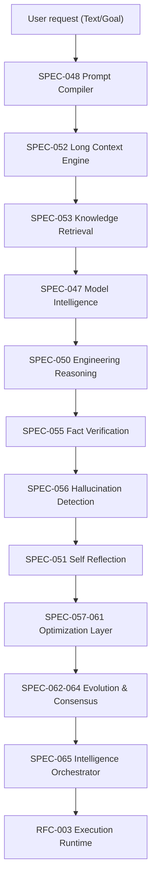

# RFC-004 — Engineering Intelligence Layer

**Status:** DRAFT  
**Author:** Architecture Review Board (ARB)  
**Date:** July 2026  

---

## 1. Executive Summary & Purpose
RFC-004 introduces the **Engineering Intelligence Layer** for Aetheris. The core purpose is to transition Aetheris from a purely execution-focused task runner into an autonomous systems-level intelligence system. This layer introduces model registry mappings, automated prompt compilation/optimization, deep cognitive reasoning, multi-model consensus validation, and dynamic skill evolution.

## 2. Structural Pipeline
The intelligence pipeline acts as a pure-function gate before the execution runtime (RFC-003) begins:

## 3. Wave Execution Schedule
The 19 SPECs (SPEC-047 through SPEC-065) are categorized into four core phases:

* **Phase A — Intelligence Core (Wave 1):** SPEC-047 (Model Intelligence), SPEC-048 (Prompt Compiler), SPEC-049 (Prompt Optimization), SPEC-050 (Reasoning), SPEC-051 (Self-Reflection).
* **Phase B — Knowledge Intelligence (Wave 2):** SPEC-052 (Long Context), SPEC-053 (Retrieval), SPEC-054 (Memory Ranking), SPEC-055 (Fact Verification), SPEC-056 (Hallucination Detection).
* **Phase C — Optimization (Wave 3):** SPEC-057 (Planning), SPEC-058 (Token), SPEC-059 (Cost), SPEC-060 (Execution), SPEC-061 (Context Optimization).
* **Phase D — Evolution (Wave 4):** SPEC-062 (Dynamic Skill Evolution), SPEC-063 (Skill Benchmark), SPEC-064 (Consensus), SPEC-065 (Intelligence Orchestrator).
