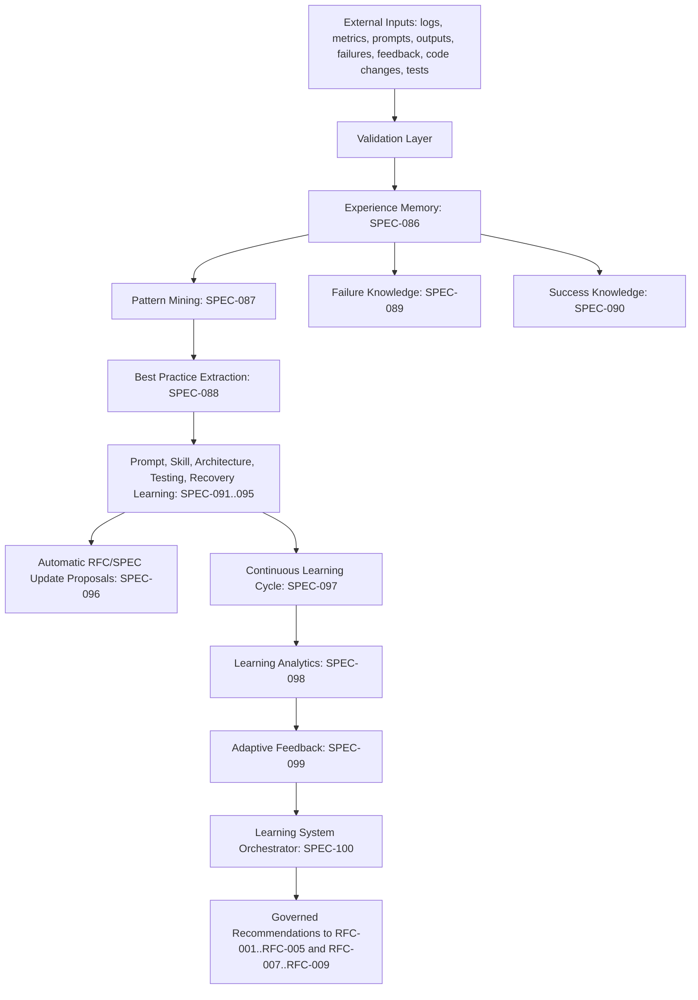
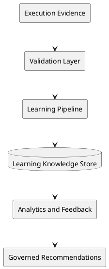

# RFC-006: Learning System

Status: Enterprise Standard Draft
Owner: Aetheris Architecture Review Board
Version: 1.0.0
Scope: SPEC-086 through SPEC-100
Upgrade Date: 2026-07-01

======================================================================
1. EXECUTIVE SUMMARY
======================================================================
The Aetheris Learning System enables the platform to improve after every execution. It captures engineering experience, mines repeated patterns, extracts validated best practices, learns from failures and successes, improves prompts, ranks skills, learns architecture and testing strategies, refines recovery behavior, proposes controlled RFC/SPEC updates, and measures whether learning improves quality, cost, reliability, and delivery speed.

RFC-006 is intentionally downstream of execution and intelligence. It does not replace RFC-001 knowledge, RFC-002 planning, RFC-003 execution, RFC-004 intelligence, or RFC-005 runtime behavior. It observes their outputs, validates learning evidence, and publishes safe recommendations back into those systems through governed contracts.

======================================================================
2. MISSION
======================================================================
The Learning System exists because autonomous engineering systems must not treat every task as a first attempt. Aetheris should remember which plans worked, which prompts failed, which architectures scaled, which recovery actions were safe, which tests caught defects, and which skills performed reliably for particular task families.

The mission of RFC-006 is to convert historical execution data into validated, versioned, explainable learning products without allowing unverified experience to mutate core architecture or runtime behavior.

======================================================================
3. LAYER ARCHITECTURE
======================================================================
```text
RFC-001 Knowledge
  -> RFC-002 Planning
  -> RFC-003 Execution
  -> RFC-004 Intelligence
  -> RFC-005 Runtime
  -> RFC-006 Learning
  -> RFC-007 Enterprise
  -> RFC-008 AI Organization
  -> RFC-009 Self-Evolution
```

RFC-006 consumes evidence from earlier layers and publishes controlled learning signals to later layers. The layer must be read-heavy, evidence-driven, auditable, and fail-closed when learning confidence is insufficient.

======================================================================
4. SUBSYSTEM MAP
======================================================================
| SPEC | Subsystem | Primary Responsibility |
|---|---|---|
| SPEC-086 | Experience Memory Engine | Capture normalized execution experience. |
| SPEC-087 | Pattern Mining Engine | Discover recurring success and failure patterns. |
| SPEC-088 | Best Practice Extraction Engine | Convert validated patterns into reusable practices. |
| SPEC-089 | Failure Knowledge Engine | Preserve failure causes and recurrence-prevention guidance. |
| SPEC-090 | Success Knowledge Engine | Preserve successful delivery paths and reusable success evidence. |
| SPEC-091 | Prompt Refinement Engine | Improve prompt templates from observed outcomes. |
| SPEC-092 | Skill Learning Engine | Improve skill routing and skill evolution from performance history. |
| SPEC-093 | Architecture Learning Engine | Learn architecture decisions and reusable architecture patterns. |
| SPEC-094 | Testing Learning Engine | Learn test strategy effectiveness and coverage gaps. |
| SPEC-095 | Recovery Learning Engine | Learn recovery strategy effectiveness and resilience patterns. |
| SPEC-096 | Automatic RFC SPEC Update Engine | Propose governed documentation and specification updates. |
| SPEC-097 | Continuous Learning Engine | Run scheduled learning cycles and publish validated improvements. |
| SPEC-098 | Learning Analytics Engine | Measure learning effectiveness and learning KPIs. |
| SPEC-099 | Adaptive Feedback Engine | Ingest feedback and close the learning loop. |
| SPEC-100 | Learning System Orchestrator | Coordinate all RFC-006 learning engines. |

======================================================================
5. REFERENCE ARCHITECTURE
======================================================================




======================================================================
6. DATA OWNERSHIP
======================================================================
RFC-006 owns learning artifacts only after they pass validation. Raw logs, prompts, metrics, failures, feedback, code changes, and tests remain owned by their source systems. Learning engines may reference source artifacts, copy normalized summaries, and store derived knowledge, but they must preserve provenance and confidence scores.

Durable RFC-006 outputs include:
- Experience records.
- Pattern clusters.
- Best-practice recommendations.
- Failure and success knowledge entries.
- Prompt, skill, architecture, testing, and recovery improvement recommendations.
- RFC/SPEC update proposals.
- Continuous learning cycle reports.
- Learning analytics scorecards.
- Adaptive feedback records.

======================================================================
7. GOVERNANCE
======================================================================
Learning outputs are recommendations unless a downstream RFC explicitly accepts them. RFC-006 must not silently rewrite prompts, skills, architectures, tests, recovery behavior, or specifications without governance.

Required governance:
- Every learning record must include source evidence.
- Every recommendation must include confidence, risk, expected benefit, and rollback guidance.
- Every automatic RFC/SPEC update must be proposed as a reviewable artifact.
- Low-confidence learning must be retained as evidence but not promoted into default behavior.
- Security-sensitive learning must be redacted, access-controlled, and audit logged.

======================================================================
8. QUALITY GATES
======================================================================
- Learning evidence completeness: 100 percent for promoted recommendations.
- Recommendation provenance: 100 percent.
- Missing confidence scores: 0.
- Critical security drift introduced by learning: 0.
- Unreviewed RFC/SPEC mutation: 0.
- Learning analytics coverage: all SPEC-086 through SPEC-100 outputs.

======================================================================
9. TESTING STRATEGY
======================================================================
RFC-006 requires unit tests for each learning engine, integration tests for the full capture-to-recommendation pipeline, regression tests for recommendation stability, load tests for large event histories, stress tests for corrupt or contradictory learning records, chaos tests for interrupted learning cycles, and learning-quality tests that measure whether recommendations actually improve subsequent runs.

======================================================================
10. REFERENCES
======================================================================
- `00_SYSTEM_CONSTITUTION.md`
- `rfcs/SPEC-086-EME2.md` through `rfcs/SPEC-100-LSO.md`
- `.aetheris/traceability/complete_traceability_matrix.md`
- `.aetheris/reports/final_arb_summary.md`
