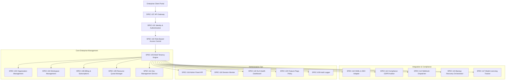

# RFC-007 — Enterprise Platform

Status: Approved / Constitution Baseline
Version: 3.0.0
Layer: Enterprise Platform Layer
Upstream: RFC-006 (Learning Layer)
Downstream: RFC-008 (AI Organization Layer)
Upgrade Date: 2026-07-01

======================================================================
1. EXECUTIVE SUMMARY
======================================================================
RFC-007 transforms Aetheris into an enterprise-grade platform capable of running in multi-user, multi-tenant corporate environments. It defines specifications SPEC-101 through SPEC-120 to govern identity, role permissions, organizational groups, tenant separation, billing structures, security compliance, webhooks, and cluster administration.

======================================================================
2. ARCHITECTURE VISION
======================================================================
The Enterprise Platform sits above the Runtime Infrastructure Layer (RFC-005) and Learning Layer (RFC-006) to orchestrate client interactions, billing limits, and corporate governance policies.

======================================================================
3. HANDBOOK SPECIFICATION DIRECTORY
======================================================================
| SPEC | Subsystem Name | Acronym | Implementation | Primary Class |
|---|---|---|---|---|
| [SPEC-101](file:///c:/AI/Agency%20owner/aetheris/rfcs/SPEC-101-Identity-Authentication-Engine.md) | Identity & Authentication Engine | IAE | `src/enterprise/auth.py` | `IdentityAuthenticationEngine` |
| [SPEC-102](file:///c:/AI/Agency%20owner/aetheris/rfcs/SPEC-102-Role-Based-Access-Control-Engine.md) | Role-Based Access Control Engine | RBAC | `src/enterprise/rbac.py` | `RoleBasedAccessControlEngine` |
| [SPEC-103](file:///c:/AI/Agency%20owner/aetheris/rfcs/SPEC-103-Organization-Management-Engine.md) | Organization Management Engine | OME | `src/enterprise/organization.py` | `OrganizationManagementEngine` |
| [SPEC-104](file:///c:/AI/Agency%20owner/aetheris/rfcs/SPEC-104-Workspace-Management-Engine.md) | Workspace Management Engine | WME | `src/enterprise/workspace.py` | `WorkspaceManagementEngine` |
| [SPEC-105](file:///c:/AI/Agency%20owner/aetheris/rfcs/SPEC-105-Multi-Tenancy-Engine.md) | Multi-Tenancy Engine | MTE | `src/enterprise/multitenant.py` | `MultiTenancyEngine` |
| [SPEC-106](file:///c:/AI/Agency%20owner/aetheris/rfcs/SPEC-106-Billing-Subscription-Engine.md) | Billing & Subscription Engine | BSE | `src/enterprise/billing.py` | `BillingSubscriptionEngine` |
| [SPEC-107](file:///c:/AI/Agency%20owner/aetheris/rfcs/SPEC-107-API-Gateway-Rate-Limiter.md) | API Gateway & Rate Limiter | AGRL | `src/enterprise/gateway.py` | `APIGatewayRateLimiter` |
| [SPEC-108](file:///c:/AI/Agency%20owner/aetheris/rfcs/SPEC-108-Enterprise-Audit-Logging-Service.md) | Enterprise Audit Logging Service | EALS | `src/enterprise/audit.py` | `EnterpriseAuditLogger` |
| [SPEC-109](file:///c:/AI/Agency%20owner/aetheris/rfcs/SPEC-109-Tenant-Resource-Quota-Manager.md) | Tenant Resource Quota Manager | TRQM | `src/enterprise/quota.py` | `TenantQuotaManager` |
| [SPEC-110](file:///c:/AI/Agency%20owner/aetheris/rfcs/SPEC-110-SAML-SSO-Integration-Adapter.md) | SAML & SSO Integration Adapter | SSOA | `src/enterprise/sso.py` | `SAMLSSOAdapter` |
| [SPEC-111](file:///c:/AI/Agency%20owner/aetheris/rfcs/SPEC-111-Key-Management-Data-Encryption-Service.md) | Key Management & Data Encryption Service | KMS | `src/enterprise/kms.py` | `KeyManagementService` |
| [SPEC-112](file:///c:/AI/Agency%20owner/aetheris/rfcs/SPEC-112-Collaboration-Real-Time-Sync-Server.md) | Collaboration & Real-Time Sync Server | CRTS | `src/enterprise/sync.py` | `CollaborationSyncServer` |
| [SPEC-113](file:///c:/AI/Agency%20owner/aetheris/rfcs/SPEC-113-Compliance-GDPR-Governance-Auditor.md) | Compliance & GDPR Governance Auditor | CGGA | `src/enterprise/compliance.py` | `ComplianceGDPRAuditor` |
| [SPEC-114](file:///c:/AI/Agency%20owner/aetheris/rfcs/SPEC-114-Notification-Webhook-Dispatcher.md) | Notification & Webhook Dispatcher | NWD | `src/enterprise/notification.py` | `NotificationWebhookDispatcher` |
| [SPEC-115](file:///c:/AI/Agency%20owner/aetheris/rfcs/SPEC-115-Backup-Disaster-Recovery-Orchestrator.md) | Backup & Disaster Recovery Orchestrator | BDRO | `src/enterprise/backup.py` | `BackupRecoveryOrchestrator` |
| [SPEC-116](file:///c:/AI/Agency%20owner/aetheris/rfcs/SPEC-116-Administrative-Control-Panel-Admin-API.md) | Administrative Control Panel (Admin API) | ACPA | `src/enterprise/admin_api.py` | `AdminAPIOrchestrator` |
| [SPEC-117](file:///c:/AI/Agency%20owner/aetheris/rfcs/SPEC-117-Model-Licensing-Usage-Tracker.md) | Model Licensing & Usage Tracker | MLUT | `src/enterprise/licensing.py` | `ModelLicensingTracker` |
| [SPEC-118](file:///c:/AI/Agency%20owner/aetheris/rfcs/SPEC-118-Agent-Activity-Session-Monitor.md) | Agent Activity & Session Monitor | AASM | `src/enterprise/monitor.py` | `AgentSessionMonitor` |
| [SPEC-119](file:///c:/AI/Agency%20owner/aetheris/rfcs/SPEC-119-System-Health-SLA-Dashboard.md) | System Health & SLA Dashboard | SHSD | `src/enterprise/health.py` | `SystemHealthSLADashboard` |
| [SPEC-120](file:///c:/AI/Agency%20owner/aetheris/rfcs/SPEC-120-Dynamic-Feature-Flag-Policy-Decider.md) | Dynamic Feature Flag & Policy Decider | DFFP | `src/enterprise/feature_flags.py` | `FeatureFlagPolicyDecider` |

======================================================================
4. PRODUCTION TESTING & VERIFICATION METHODOLOGY
======================================================================
Enterprise services require strict regression testing.
1. **Penetration & Path Traversal Verification:** Ensure workspace allocations block relative file lookups outside tenant folders.
2. **SSO & Role Claim Validations:** Test corporate claim translations, asserting correct user tier capabilities.
3. **GDPR Purge Integrity:** Automatically assert database deletions remove PII completely.

======================================================================
5. REFERENCES
======================================================================
- `00_SYSTEM_CONSTITUTION.md`
- `aetheris/rfcs/SPEC-101-Identity-Authentication-Engine.md` through `SPEC-120-Dynamic-Feature-Flag-Policy-Decider.md`
