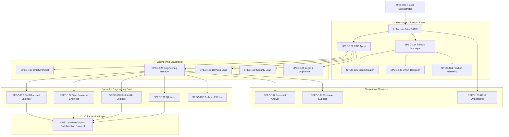

# RFC-008 — AI Organization

Status: Approved / Constitution Baseline
Version: 3.0.0
Layer: AI Organization Layer
Upstream: RFC-007 (Enterprise Layer)
Downstream: RFC-009 (Self-Evolution Layer)
Upgrade Date: 2026-07-01

======================================================================
1. EXECUTIVE SUMMARY
======================================================================
RFC-008 transforms Aetheris from an intelligent engineering planner into a complete, autonomous software engineering organization composed of specialized AI agent roles that collaborate through structured protocols. 

Volume V documents specifications SPEC-121 through SPEC-140, defining the strategic executive agents, engineering roles, quality assurance gates, project tracking systems, and multi-agent event loop configurations.

======================================================================
2. ARCHITECTURE VISION
======================================================================
The AI Organization functions above the Enterprise Layer (RFC-007) and schedules tasks dynamically across specialized agents.

======================================================================
3. HANDBOOK SPECIFICATION DIRECTORY
======================================================================
| SPEC | Subsystem Name | Acronym | Implementation | Primary Class |
|---|---|---|---|---|
| [SPEC-121](file:///c:/AI/Agency%20owner/aetheris/rfcs/SPEC-121-CEO-Agent.md) | CEO Agent | CEO | `src/organization/ceo.py` | `CEOAgent` |
| [SPEC-122](file:///c:/AI/Agency%20owner/aetheris/rfcs/SPEC-122-CTO-Agent.md) | CTO Agent | CTO | `src/organization/cto.py` | `CTOAgent` |
| [SPEC-123](file:///c:/AI/Agency%20owner/aetheris/rfcs/SPEC-123-Chief-Architect-Agent.md) | Chief Architect Agent | CAA | `src/organization/architect.py` | `ChiefArchitectAgent` |
| [SPEC-124](file:///c:/AI/Agency%20owner/aetheris/rfcs/SPEC-124-Product-Manager-Agent.md) | Product Manager Agent | PMA | `src/organization/pm.py` | `ProductManagerAgent` |
| [SPEC-125](file:///c:/AI/Agency%20owner/aetheris/rfcs/SPEC-125-Engineering-Manager-Agent.md) | Engineering Manager Agent | EMA | `src/organization/em.py` | `EngineeringManagerAgent` |
| [SPEC-126](file:///c:/AI/Agency%20owner/aetheris/rfcs/SPEC-126-Staff-Backend-Engineer.md) | Staff Backend Engineer | SBE | `src/organization/backend.py` | `StaffBackendEngineerAgent` |
| [SPEC-127](file:///c:/AI/Agency%20owner/aetheris/rfcs/SPEC-127-Staff-Frontend-Engineer.md) | Staff Frontend Engineer | SFE | `src/organization/frontend.py` | `StaffFrontendEngineerAgent` |
| [SPEC-128](file:///c:/AI/Agency%20owner/aetheris/rfcs/SPEC-128-Staff-AI-ML-Engineer.md) | Staff AI/ML Engineer | MLE | `src/organization/aiml.py` | `StaffAIMLEngineerAgent` |
| [SPEC-129](file:///c:/AI/Agency%20owner/aetheris/rfcs/SPEC-129-DevOps-Lead.md) | DevOps Lead | DOL | `src/organization/devops.py` | `DevOpsLeadAgent` |
| [SPEC-130](file:///c:/AI/Agency%20owner/aetheris/rfcs/SPEC-130-Security-Lead.md) | Security Lead | SEC | `src/organization/security.py` | `SecurityLeadAgent` |
| [SPEC-131](file:///c:/AI/Agency%20owner/aetheris/rfcs/SPEC-131-QA-Lead-Agent.md) | QA Lead Agent | QAL | `src/organization/qa.py` | `QALeadAgent` |
| [SPEC-132](file:///c:/AI/Agency%20owner/aetheris/rfcs/SPEC-132-Technical-Writer-Agent.md) | Technical Writer Agent | TWA | `src/organization/writer.py` | `TechnicalWriterAgent` |
| [SPEC-133](file:///c:/AI/Agency%20owner/aetheris/rfcs/SPEC-133-UX-UI-Designer-Agent.md) | UX/UI Designer Agent | UDA | `src/organization/designer.py` | `UXUIDesignerAgent` |
| [SPEC-134](file:///c:/AI/Agency%20owner/aetheris/rfcs/SPEC-134-Product-Marketing-Manager-Agent.md) | Product Marketing Manager Agent | PMM | `src/organization/marketing.py` | `ProductMarketingManagerAgent` |
| [SPEC-135](file:///c:/AI/Agency%20owner/aetheris/rfcs/SPEC-135-Legal-Compliance-Officer-Agent.md) | Legal & Compliance Officer Agent | LCO | `src/organization/legal.py` | `LegalComplianceOfficerAgent` |
| [SPEC-136](file:///c:/AI/Agency%20owner/aetheris/rfcs/SPEC-136-Scrum-Master-Agile-Coordinator-Agent.md) | Scrum Master & Agile Coordinator Agent | SMA | `src/organization/scrum.py` | `ScrumMasterAgent` |
| [SPEC-137](file:///c:/AI/Agency%20owner/aetheris/rfcs/SPEC-137-Financial-Analyst-Budget-Controller-Agent.md) | Financial Analyst & Budget Controller Agent | FAC | `src/organization/finance.py` | `FinancialAnalystAgent` |
| [SPEC-138](file:///c:/AI/Agency%20owner/aetheris/rfcs/SPEC-138-Customer-Support-Feedback-Synthesizer-Agent.md) | Customer Support & Feedback Synthesizer Agent | CSF | `src/organization/support.py` | `CustomerSupportAgent` |
| [SPEC-139](file:///c:/AI/Agency%20owner/aetheris/rfcs/SPEC-139-Human-Resources-Onboarding-Agent.md) | Human Resources & Onboarding Agent | HRA | `src/organization/hr.py` | `HROnboardingAgent` |
| [SPEC-140](file:///c:/AI/Agency%20owner/aetheris/rfcs/SPEC-140-Multi-Agent-Collaboration-Protocol.md) | Multi-Agent Collaboration Protocol | MACP | `src/organization/orchestrator.py` | `MultiAgentCollaborationOrchestrator` |

======================================================================
4. PRODUCTION TESTING & VERIFICATION METHODOLOGY
======================================================================
Agent role execution verification:
1. **Mock Handoff Executions:** Run simulation tests showing task handoffs from PM -> EM -> Backend -> QA -> PM to verify process completeness.
2. **Budget Freezing Verification:** Validate that the Financial Analyst Agent correctly halts execution loops when cost parameters are exceeded.
3. **MACP Envelope Conformance Check:** Audit all multi-agent JSON-RPC communication frames to assert schema compliance.

======================================================================
5. REFERENCES
======================================================================
- `00_SYSTEM_CONSTITUTION.md`
- `aetheris/rfcs/SPEC-121-CEO-Agent.md` through `SPEC-140-Multi-Agent-Collaboration-Protocol.md`
