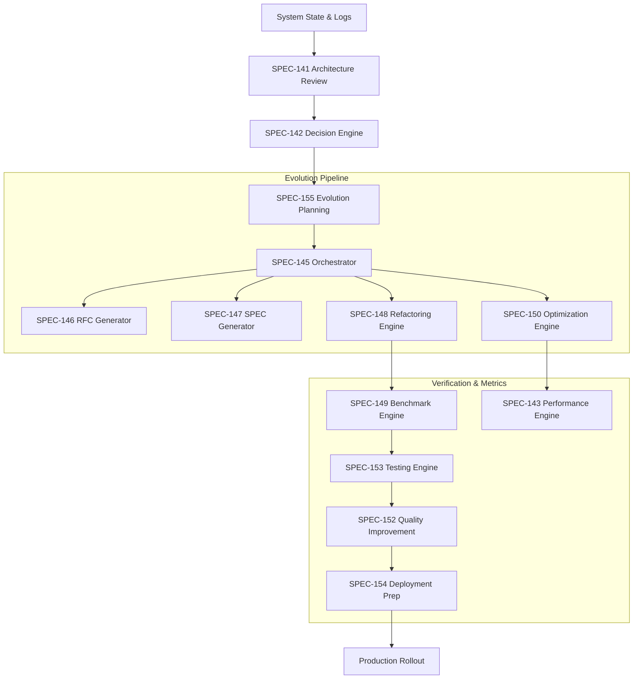

# RFC-009 — Self-Evolution

Status: Approved / Constitution Baseline
Version: 3.0.0
Layer: Self-Evolution Layer
Upstream: RFC-008 (AI Organization Layer)
Downstream: None
Upgrade Date: 2026-07-01

======================================================================
1. EXECUTIVE SUMMARY
======================================================================
The Self-Evolution Layer (RFC-009) represents the self-improvement and optimization capabilities of the Aetheris Operating System. It enables Aetheris to dynamically audit its architecture, evaluate risk options, write code optimizations, and deploy validated system updates.

This handbook consists of two volumes:
- **Volume I (SPEC-141 through SPEC-155):** Defines the core execution modules, document generators, refactoring services, and testing frameworks.
- **Volume II (SPEC-156 through SPEC-170):** Defines autonomous deployment systems, runtime optimization engines, self-validation hooks, self-governance frameworks, and incident response/recovery evolution engines.

======================================================================
2. ARCHITECTURE VISION
======================================================================
The Self-Evolution layer schedule loops run asynchronously, observing system states and compiling updates.

======================================================================
3. HANDBOOK SPECIFICATION DIRECTORY
======================================================================

### Volume I (SPEC-141 → SPEC-155)
| SPEC | Subsystem Name | Acronym | Implementation | Primary Class |
|---|---|---|---|---|
| [SPEC-141](file:///c:/AI/Agency%20owner/aetheris/rfcs/SPEC-141-Self-Architecture-Review-Engine.md) | Self Architecture Review Engine | SARE | `src/evolution/architecture_review.py` | `SelfArchitectureReviewEngine` |
| [SPEC-142](file:///c:/AI/Agency%20owner/aetheris/rfcs/SPEC-142-Self-Decision-Engine.md) | Self Decision Engine | SDE | `src/evolution/decision.py` | `SelfDecisionEngine` |
| [SPEC-143](file:///c:/AI/Agency%20owner/aetheris/rfcs/SPEC-143-Self-Performance-Engine.md) | Self Performance Engine | SPE2 | `src/evolution/performance.py` | `SelfPerformanceEngine` |
| [SPEC-144](file:///c:/AI/Agency%20owner/aetheris/rfcs/SPEC-144-Self-Learning-Engine.md) | Self Learning Engine | SLE2 | `src/evolution/learning.py` | `SelfLearningEngine` |
| [SPEC-145](file:///c:/AI/Agency%20owner/aetheris/rfcs/SPEC-145-Self-Evolution-Orchestrator.md) | Self Evolution Orchestrator | SEO2 | `src/evolution/orchestrator.py` | `SelfEvolutionOrchestrator` |
| [SPEC-146](file:///c:/AI/Agency%20owner/aetheris/rfcs/SPEC-146-Self-RFC-Generation-Engine.md) | Self RFC Generation Engine | SRGE | `src/evolution/rfc_gen.py` | `SelfRFCGenerationEngine` |
| [SPEC-147](file:///c:/AI/Agency%20owner/aetheris/rfcs/SPEC-147-Self-SPEC-Generation-Engine.md) | Self SPEC Generation Engine | SSGE | `src/evolution/spec_gen.py` | `SelfSPECGenerationEngine` |
| [SPEC-148](file:///c:/AI/Agency%20owner/aetheris/rfcs/SPEC-148-Self-Refactoring-Engine.md) | Self Refactoring Engine | SRE3 | `src/evolution/refactor.py` | `SelfRefactoringEngine` |
| [SPEC-149](file:///c:/AI/Agency%20owner/aetheris/rfcs/SPEC-149-Self-Benchmark-Engine.md) | Self Benchmark Engine | SBE2 | `src/evolution/benchmark.py` | `SelfBenchmarkEngine` |
| [SPEC-150](file:///c:/AI/Agency%20owner/aetheris/rfcs/SPEC-150-Self-Optimization-Engine.md) | Self Optimization Engine | SOE3 | `src/evolution/optimize.py` | `SelfOptimizationEngine` |
| [SPEC-151](file:///c:/AI/Agency%20owner/aetheris/rfcs/SPEC-151-Self-Cost-Reduction-Engine.md) | Self Cost Reduction Engine | SCRE | `src/evolution/cost_reduction.py` | `SelfCostReductionEngine` |
| [SPEC-152](file:///c:/AI/Agency%20owner/aetheris/rfcs/SPEC-152-Self-Quality-Improvement-Engine.md) | Self Quality Improvement Engine | SQIE | `src/evolution/quality_improvement.py` | `SelfQualityImprovementEngine` |
| [SPEC-153](file:///c:/AI/Agency%20owner/aetheris/rfcs/SPEC-153-Self-Testing-Engine.md) | Self Testing Engine | STE2 | `src/evolution/testing.py` | `SelfTestingEngine` |
| [SPEC-154](file:///c:/AI/Agency%20owner/aetheris/rfcs/SPEC-154-Self-Deployment-Preparation-Engine.md) | Self Deployment Preparation Engine | SDPE2 | `src/evolution/deployment_prep.py` | `SelfDeploymentPreparationEngine` |
| [SPEC-155](file:///c:/AI/Agency%20owner/aetheris/rfcs/SPEC-155-Evolution-Planning-Engine.md) | Evolution Planning Engine | EPE3 | `src/evolution/planning.py` | `EvolutionPlanningEngine` |

### Volume II (SPEC-156 → SPEC-170)
| SPEC | Subsystem Name | Acronym | Implementation | Primary Class |
|---|---|---|---|---|
| [SPEC-156](file:///c:/AI/Agency%20owner/aetheris/rfcs/SPEC-156-Autonomous-Deployment-Engine.md) | Autonomous Deployment Engine | ADE | `src/evolution/deployment.py` | `AutonomousDeploymentEngine` |
| [SPEC-157](file:///c:/AI/Agency%20owner/aetheris/rfcs/SPEC-157-Self-Validation-Engine.md) | Self Validation Engine | SVE | `src/evolution/validation.py` | `SelfValidationEngine` |
| [SPEC-158](file:///c:/AI/Agency%20owner/aetheris/rfcs/SPEC-158-Self-Governance-Engine.md) | Self Governance Engine | SGE | `src/evolution/governance.py` | `SelfGovernanceEngine` |
| [SPEC-159](file:///c:/AI/Agency%20owner/aetheris/rfcs/SPEC-159-Self-Policy-Evolution-Engine.md) | Self Policy Evolution Engine | SPEE | `src/evolution/policy_evolution.py` | `SelfPolicyEvolutionEngine` |
| [SPEC-160](file:///c:/AI/Agency%20owner/aetheris/rfcs/SPEC-160-Autonomous-Incident-Response-Engine.md) | Autonomous Incident Response Engine | AIRE | `src/evolution/incident_response.py` | `AutonomousIncidentResponseEngine` |
| [SPEC-161](file:///c:/AI/Agency%20owner/aetheris/rfcs/SPEC-161-Autonomous-Recovery-Evolution-Engine.md) | Autonomous Recovery Evolution Engine | AREE | `src/evolution/recovery_evolution.py` | `AutonomousRecoveryEvolutionEngine` |
| [SPEC-162](file:///c:/AI/Agency%20owner/aetheris/rfcs/SPEC-162-Self-Knowledge-Expansion-Engine.md) | Self Knowledge Expansion Engine | SKEE | `src/evolution/knowledge_expansion.py` | `SelfKnowledgeExpansionEngine` |
| [SPEC-163](file:///c:/AI/Agency%20owner/aetheris/rfcs/SPEC-163-Self-Skill-Creation-Engine.md) | Self Skill Creation Engine | SSCE | `src/evolution/skill_creation.py` | `SelfSkillCreationEngine` |
| [SPEC-164](file:///c:/AI/Agency%20owner/aetheris/rfcs/SPEC-164-Self-Runtime-Optimization-Engine.md) | Self Runtime Optimization Engine | SROE | `src/evolution/runtime_optimization.py` | `SelfRuntimeOptimizationEngine` |
| [SPEC-165](file:///c:/AI/Agency%20owner/aetheris/rfcs/SPEC-165-Self-Infrastructure-Evolution-Engine.md) | Self Infrastructure Evolution Engine | SIEE | `src/evolution/infrastructure_evolution.py` | `SelfInfrastructureEvolutionEngine` |
| [SPEC-166](file:///c:/AI/Agency%20owner/aetheris/rfcs/SPEC-166-Self-Security-Evolution-Engine.md) | Self Security Evolution Engine | SSEE | `src/evolution/security_evolution.py` | `SelfSecurityEvolutionEngine` |
| [SPEC-167](file:///c:/AI/Agency%20owner/aetheris/rfcs/SPEC-167-Autonomous-Research-Engine.md) | Autonomous Research Engine | ARE | `src/evolution/research.py` | `AutonomousResearchEngine` |
| [SPEC-168](file:///c:/AI/Agency%20owner/aetheris/rfcs/SPEC-168-Continuous-Innovation-Engine.md) | Continuous Innovation Engine | CIE | `src/evolution/innovation.py` | `ContinuousInnovationEngine` |
| [SPEC-169](file:///c:/AI/Agency%20owner/aetheris/rfcs/SPEC-169-Autonomous-Platform-Evolution-Engine.md) | Autonomous Platform Evolution Engine | APEE | `src/evolution/platform_evolution.py` | `AutonomousPlatformEvolutionEngine` |
| [SPEC-170](file:///c:/AI/Agency%20owner/aetheris/rfcs/SPEC-170-Global-Self-Evolution-Orchestrator.md) | Global Self-Evolution Orchestrator | GSEO | `src/evolution/global_orchestrator.py` | `GlobalSelfEvolutionOrchestrator` |

======================================================================
4. PRODUCTION TESTING & VERIFICATION METHODOLOGY
======================================================================
Self-evolution verification loop:
1. **Mock Refactor Checkouts:** Assert that refactoring runs successfully clean and compile code templates under testing limits.
2. **Quality Gate Auditing:** Confirm that quality improvement runs block pipelines when test coverage drops.
3. **Rollback Verification:** Validate that compilation errors trigger full Git rollback operations.

======================================================================
5. REFERENCES
======================================================================
- `00_SYSTEM_CONSTITUTION.md`
- `aetheris/rfcs/SPEC-141-Self-Architecture-Review-Engine.md` through `SPEC-170-Global-Self-Evolution-Orchestrator.md`
