# SPEC-054: Memory Ranking Engine (MRE)

Status: Enterprise Standard Draft
Version: 2.0.0
Parent RFC: RFC-004
Layer: Engineering Intelligence Layer
Scope: Wave 2 - Knowledge Intelligence
Canonical Standard: SPEC-047 Enterprise Standard
Upgrade Date: 2026-07-01
Implementation: `src/intelligence/mre.py` (validated from source metadata)
Primary Class: `MemoryRankingEngine`
Test Reference: `tests/test_rfc004_core.py`

======================================================================
1. EXECUTIVE SUMMARY
======================================================================
Memory Ranking Engine exists to make Engineering Intelligence Layer deterministic, reviewable, and safe at production scale. Ranks memory records by relevance, confidence, freshness, success rate, and applicability to the current engineering task.

This document upgrades SPEC-054 from a lightweight subsystem note into an enterprise engineering specification. It defines why the engine exists, how it operates internally, which contracts it owns, how it interacts with neighboring engines, how it fails, how it recovers, how engineers should test it, and how future changes should preserve compatibility with the Aetheris constitution.

SPEC-054 is part of the Engineering Intelligence Layer, where prompts, evidence, model choices, reasoning, verification, optimization, and skill evolution are coordinated.

======================================================================
2. PURPOSE
======================================================================
The purpose of MRE is to own the full engineering responsibility for wave 2 - knowledge intelligence. It converts upstream evidence into a downstream-safe contract without asking later engines to infer missing details.

The engine is necessary because Aetheris is an Autonomous Software Engineering Operating System, not a best-effort prompt chain. Each engine must own one bounded transformation, produce typed evidence, record what it decided, and allow downstream engines to continue without reinterpreting raw context.

Alternatives rejected:
- Embedding MRE behavior into a general orchestrator was rejected because it hides ownership and makes failures hard to isolate.
- Letting downstream engines reconstruct wave 2 - knowledge intelligence was rejected because it duplicates logic and creates inconsistent plans.
- Relying on unstructured markdown output was rejected because execution, recovery, validation, and telemetry require machine-readable contracts.

======================================================================
3. GOALS
======================================================================
- Provide a deterministic implementation contract for wave 2 - knowledge intelligence.
- Accept only validated upstream artifacts from SPEC-007 EKB, execution history, decision history.
- Emit structured output that can be consumed by SPEC-053 KRE, SPEC-057 PLE.
- Record artifacts and telemetry so decisions are inspectable after execution.
- Fail closed when required evidence is missing, malformed, stale, or contradictory.
- Keep implementation behavior aligned with the Aetheris constitution, RFC boundaries, and SPEC-047 enterprise standard.
- Support incremental improvement without breaking public contracts or historical artifacts.

======================================================================
4. SCOPE
======================================================================
In scope:
- Wave 2 - Knowledge Intelligence
- Validation of all MRE input and output structures.
- Artifact generation, EKB registration, telemetry emission, and downstream handoff.
- Recovery behavior for missing inputs, invalid contracts, stale cache, and partial execution.
- Operational guidance for tests, observability, security, performance, and future evolution.

Out of scope:
- Owning responsibilities assigned to upstream or downstream SPECs.
- Executing arbitrary user project code unless another SPEC explicitly grants that responsibility.
- Persisting secrets, API keys, or opaque model credentials in generated artifacts.
- Silently fabricating missing evidence or architecture conclusions.

======================================================================
5. RESPONSIBILITIES
======================================================================
- Own the transformation from `SPEC-054` input contract to `SPEC-054` output contract.
- Use `src/intelligence/mre.py` as the implementation boundary and `MemoryRankingEngine` as the primary class boundary.
- Validate all required upstream evidence before starting irreversible work.
- Generate typed artifacts only in the engine-owned output directories or documented EKB objects.
- Emit structured errors that allow PRE, SPE, EME, and IO to classify, persist, recover, or report the failure.
- Maintain backward-compatible public APIs unless the parent RFC version is advanced.
- Expose enough traceability for a senior engineer to audit decisions without reverse-engineering the code.

======================================================================
6. DESIGN PHILOSOPHY
======================================================================
MRE follows the Aetheris principle: think more, generate less, reuse whenever possible. The engine should perform the minimum deterministic transformation that completely satisfies its contract and should reuse upstream artifacts instead of rescanning or re-deriving evidence.

The design is intentionally layered:
- Upstream engines provide evidence.
- MRE validates and transforms that evidence.
- EKB and artifact storage preserve the result.
- Downstream engines consume only the validated contract.

This design makes the engine independently testable and allows failures to be traced to a specific SPEC boundary.

======================================================================
7. ENGINEERING PRINCIPLES
======================================================================
- Determinism: identical validated inputs must produce equivalent outputs except for timestamps and run identifiers.
- Evidence-first operation: conclusions must reference upstream artifacts, source files, tests, or recorded EKB objects.
- Single responsibility: the engine must not absorb neighboring SPEC behavior for convenience.
- Typed boundaries: public APIs must accept and return structured payloads.
- Idempotent persistence: rerunning the same request should not corrupt historical artifacts.
- Fail-closed security: missing authorization, secrets, or unknown file paths must halt the unsafe branch.
- Observability by default: every run must be measurable and explainable.
- Recovery readiness: failures must include enough information to retry, roll back, or continue safely.

======================================================================
8. FUNCTIONAL REQUIREMENTS
======================================================================
- FR-001: MRE shall load the upstream artifacts declared by SPEC-007 EKB, execution history, decision history.
- FR-002: MRE shall validate `request_id`, `workspace_path`, `spec_id`, and payload shape before execution.
- FR-003: MRE shall execute the primary behavior owned by `MemoryRankingEngine`.
- FR-004: MRE shall emit an output contract containing status, artifacts, EKB object identifiers, warnings, and telemetry.
- FR-005: The engine shall distinguish hard failures from partial completion and skipped work.
- FR-006: The engine shall preserve upstream traceability in every generated result.
- FR-007: The engine shall expose stable public APIs for orchestrator use.
- FR-008: The engine shall be safe to rerun after a crash or interrupted execution.

======================================================================
9. NON-FUNCTIONAL REQUIREMENTS
======================================================================
- Latency target: complete pure-function intelligence operations in less than 100 milliseconds where no model call is required.
- Reliability target: no unhandled exception should leave partially written artifacts without an error record.
- Compatibility target: output contracts must remain backward compatible for minor version upgrades.
- Security target: no secret value may be written to markdown, JSON, logs, telemetry, or EKB records.
- Scalability target: processing must scale with relevant input size, not with the entire repository when cached evidence exists.
- Maintainability target: implementation must remain readable, modular, and testable by a senior engineer in isolation.
- Auditability target: every material decision must be explainable through input evidence or deterministic rules.

======================================================================
10. SYSTEM CONTEXT
======================================================================
SPEC-054 sits in `Engineering Intelligence Layer` under `RFC-004`. It is not an isolated utility; it is one stage in the Aetheris operating-system pipeline.

Upstream dependencies:
- SPEC-007 EKB
- execution history
- decision history

Downstream consumers:
- SPEC-053 KRE
- SPEC-057 PLE

The engine must treat upstream data as evidence, not truth. It must validate structure and consistency before use. Downstream engines must treat MRE output as the authoritative contract for wave 2 - knowledge intelligence unless a later validation SPEC rejects it.

======================================================================
11. INTERNAL ARCHITECTURE
======================================================================
Primary implementation path: `src/intelligence/mre.py`.

Primary implementation class: `MemoryRankingEngine`.

Implementation classes in scope:
- `MemoryRankingEngine`

Core architecture:
- Public API boundary accepts the invocation payload.
- Validation layer checks identity, required upstream artifacts, and payload shape.
- Core transformation layer performs the domain-specific work described by this SPEC.
- Persistence layer writes artifacts and EKB records.
- Telemetry layer emits timing, status, warnings, and error classification.
- Downstream handoff layer returns the typed output contract.

======================================================================
12. EXTERNAL ARCHITECTURE
======================================================================
MRE is invoked by the Aetheris kernel, an orchestrator, or a parent pipeline runner. It should not require callers to know implementation internals.

External callers see:
- Stable input schema.
- Stable output schema.
- Public methods listed in this document.
- Typed exceptions or failure objects.
- Generated artifacts in known directories.

External callers must not depend on private helper classes, internal cache format, temporary file names, or incidental implementation details.

======================================================================
13. LAYER INTERACTIONS
======================================================================
Layer interactions are governed by the parent RFC boundary:
- `RFC-004` owns why this engine exists.
- `SPEC-054` owns how the engine is implemented.
- `SPEC-007 EKB` owns durable typed memory when EKB records are registered.
- `SPEC-045 EME` owns aggregate execution metrics.
- `SPEC-041 PRE` owns patch recovery when implementation errors are recoverable.
- `SPEC-042 SPE` owns resumable state when the run is interrupted.

MRE must exchange data by contract, not by implicit global state.

======================================================================
14. EXECUTION LIFECYCLE
======================================================================
1. Receive invocation payload from upstream pipeline or orchestrator.
2. Validate request identity, spec identity, workspace path, control flags, and payload shape.
3. Resolve upstream artifact references and confirm they are readable within the workspace boundary.
4. Execute `MemoryRankingEngine` behavior for wave 2 - knowledge intelligence.
5. Validate the produced output contract and generated artifacts.
6. Persist artifacts, EKB objects, and telemetry.
7. Return structured success, partial success, skipped, or failed status to downstream consumers.

======================================================================
15. SEQUENCE OF OPERATIONS
======================================================================
Canonical sequence:
1. Load upstream dependencies: SPEC-007 EKB, execution history, decision history.
2. Normalize input payload into the internal domain model.
3. Reject missing, stale, or contradictory evidence before executing core behavior.
4. Run the MRE core transformation.
5. Generate artifacts and EKB records.
6. Validate output against the JSON schema in this SPEC.
7. Release the output to SPEC-053 KRE, SPEC-057 PLE.

======================================================================
16. STATE MACHINE
======================================================================
- `Idle`: No active invocation is being processed.
- `ValidatingInput`: Contract, workspace path, upstream artifact, and payload checks are running.
- `Running`: Core transformation is active.
- `ValidatingOutput`: Generated result is checked against schema and downstream expectations.
- `PersistingArtifacts`: Output files, telemetry, and EKB records are written atomically where possible.
- `Completed`: Output is released to downstream engines.
- `Recovering`: Retry or fallback behavior is active after a known failure mode.
- `Failed`: No valid output can be released and downstream execution must halt or route to recovery.

======================================================================
17. COMPONENT BREAKDOWN
======================================================================
- `InputContract`: Captures request identity, workspace path, upstream artifacts, control flags, and payload.
- `InputValidator`: Enforces schema, workspace boundary, and required dependency checks.
- `MemoryRankingEngine`: Owns the core wave 2 - knowledge intelligence behavior.
- `ArtifactWriter`: Persists JSON, markdown, graph, report, checkpoint, or plan artifacts.
- `EKBAdapter`: Registers typed objects and preserves traceability when the engine owns durable knowledge.
- `TelemetryEmitter`: Records duration, status, warnings, errors, and downstream handoff metadata.
- `OutputValidator`: Verifies schema, required artifact references, and status semantics before release.

======================================================================
18. INTERNAL MODULES
======================================================================
Internal modules and helper classes should stay private unless explicitly listed as public APIs.

Detected implementation classes:
- `MemoryRankingEngine`

Detected class docstrings:
- Ranks memory records by relevance, confidence, freshness, success rate, and applicability to the current engineering task.

Engineers extending this SPEC should prefer adding small helper classes under the same module boundary before introducing cross-layer dependencies.

======================================================================
19. INTERFACES
======================================================================
Interface boundaries:
- Input interface: `MREInput` JSON object.
- Output interface: `MREOutput` JSON object.
- Source interface: `src/intelligence/mre.py`.
- Public class boundary: `MemoryRankingEngine`.
- EKB interface: `EngineeringKnowledgeBase.register_object`, `get_object`, and `query_objects` when persistent memory is required.
- Telemetry interface: event records and metrics consumed by `SPEC-045 EME`.

Interfaces must be stable, documented, and covered by tests before downstream SPECs depend on them.

======================================================================
20. PUBLIC APIS
======================================================================
| API | Purpose | Reliability Contract |
|---|---|---|
| `rank_memories(memories: list) -> list` | Executes the `rank_memories` responsibility for MRE. | Validate input, avoid hidden side effects outside owned artifact paths, return deterministic structured output, and emit traceable failures. |

======================================================================
21. INTERNAL APIS
======================================================================
Internal APIs include private helper methods, local validators, cache utilities, and artifact writers. They may change between patch versions when public contracts remain stable.

Internal API rules:
- Prefix non-public helpers with an underscore or keep them module-local.
- Do not expose raw file handles, mutable global state, or unvalidated dictionaries to downstream engines.
- Return structured data from helpers so tests can assert behavior without reading files when practical.
- Keep helper methods deterministic and side-effect free unless they explicitly belong to the persistence layer.

======================================================================
22. DATA CONTRACTS AND JSON SCHEMAS
======================================================================
Input contract:
```json
{
  "$schema": "https://json-schema.org/draft/2020-12/schema",
  "title": "MREInput",
  "type": "object",
  "required": [
    "request_id",
    "spec_id",
    "workspace_path",
    "payload"
  ],
  "properties": {
    "request_id": {
      "type": "string",
      "minLength": 8
    },
    "spec_id": {
      "const": "SPEC-054"
    },
    "workspace_path": {
      "type": "string"
    },
    "upstream_artifacts": {
      "type": "array",
      "items": {
        "type": "string"
      }
    },
    "control_flags": {
      "type": "object",
      "additionalProperties": true
    },
    "payload": {
      "type": "object",
      "additionalProperties": true
    }
  }
}
```
Output contract:
```json
{
  "$schema": "https://json-schema.org/draft/2020-12/schema",
  "title": "MREOutput",
  "type": "object",
  "required": [
    "request_id",
    "spec_id",
    "status",
    "artifacts",
    "telemetry"
  ],
  "properties": {
    "request_id": {
      "type": "string"
    },
    "spec_id": {
      "const": "SPEC-054"
    },
    "status": {
      "enum": [
        "SUCCEEDED",
        "FAILED",
        "PARTIAL",
        "SKIPPED"
      ]
    },
    "artifacts": {
      "type": "array",
      "items": {
        "type": "string"
      }
    },
    "ekb_objects": {
      "type": "array",
      "items": {
        "type": "string"
      }
    },
    "warnings": {
      "type": "array",
      "items": {
        "type": "string"
      }
    },
    "telemetry": {
      "type": "object",
      "required": [
        "started_at",
        "finished_at",
        "duration_ms"
      ],
      "properties": {
        "started_at": {
          "type": "string"
        },
        "finished_at": {
          "type": "string"
        },
        "duration_ms": {
          "type": "number",
          "minimum": 0
        },
        "source_path": {
          "const": "src/intelligence/mre.py"
        }
      }
    }
  }
}
```
Example invocation payload:
```json
{
  "request_id": "req-spec-054-example",
  "spec_id": "SPEC-054",
  "workspace_path": "<workspace>",
  "upstream_artifacts": [
    "SPEC-007 EKB",
    "execution history",
    "decision history"
  ],
  "payload": {
    "engine": "Memory Ranking Engine",
    "source_class": "MemoryRankingEngine",
    "public_methods": [
      "rank_memories(memories: list) -> list"
    ]
  }
}
```

======================================================================
23. CONFIGURATION AND ENVIRONMENT VARIABLES
======================================================================
Configuration sources:
- Repository defaults under `aetheris/config/` when applicable.
- Workspace-scoped state under `.aetheris/`.
- Runtime override flags in the invocation payload.
- Environment variables only for documented path, feature, or provider overrides.

Recommended environment variables:
- `AETHERIS_MRE_ENABLED`: Optional feature gate for this engine.
- `AETHERIS_MRE_STRICT`: When true, converts warnings to failures for CI or release validation.
- `AETHERIS_MRE_OUTPUT_DIR`: Optional override for generated artifacts during tests.

Secrets must never be supplied through generated SPEC artifacts. Provider tokens, credentials, and private keys must remain in the platform secret store or caller environment and must be redacted from telemetry.

======================================================================
24. GENERATED ARTIFACTS
======================================================================
The current `src/intelligence/mre.py` implementation is primarily in-memory. The enterprise contract still requires MRE to expose generated artifacts through the common result envelope and to persist telemetry through the EKB when promoted to production.

No EKB object is currently registered by the source implementation. The production contract must register a typed result object before downstream engines consume the output.

======================================================================
25. INPUT VALIDATION
======================================================================
- `spec_id` must equal the current SPEC identifier.
- `request_id` must be present, unique for the execution attempt, and safe for logs.
- `workspace_path` must resolve inside the active Aetheris workspace or an explicitly allowed test workspace.
- All upstream artifact references must exist, be readable, and match expected JSON or markdown structure.
- Payload dictionaries must contain only supported keys unless the schema explicitly allows extension fields.
- Control flags must be typed and must not disable mandatory safety, validation, telemetry, or security checks.
- Input data containing secrets must be rejected or redacted before persistence.

======================================================================
26. OUTPUT VALIDATION
======================================================================
- Output must include status, artifacts, EKB object identifiers, warnings, and telemetry.
- Artifacts listed in the output must exist or be marked as intentionally in-memory.
- Failed outputs must include classification, message, retryability, and recovery guidance.
- Partial outputs must identify which required artifacts are missing and which downstream engines are blocked.
- EKB object identifiers must resolve successfully after registration.
- Telemetry duration must be non-negative and status must match the output status.

======================================================================
27. FAILURE MODES
======================================================================
- Missing upstream artifact or empty required input.
- Malformed JSON, markdown, graph, or schema payload.
- Workspace path violation or unreadable file due to permissions.
- Conflicting evidence between upstream plans, EKB records, and current workspace state.
- Output artifact write failure, partial write, or checksum mismatch.
- Unexpected implementation exception inside the primary class.
- Telemetry sink unavailable or EKB registration failure.
- Downstream contract incompatibility after a version change.

======================================================================
28. RECOVERY STRATEGY
======================================================================
Recovery is conservative. MRE may retry idempotent reads, regenerate deterministic artifacts, or fall back to a documented safe default. It must not fabricate architecture, code, security, cost, or evidence decisions to hide missing data.

Recovery actions:
- Re-read upstream artifacts once when the first read fails because of a transient filesystem condition.
- Regenerate deterministic output artifacts from validated inputs when prior files are missing or corrupt.
- Register a failure object in EKB when recovery cannot produce a safe output.
- Delegate patchable implementation errors to SPEC-041 PRE.
- Delegate interrupted runs to SPEC-042 SPE when checkpoint state is available.
- Fail closed when secrets, path traversal, or evidence fabrication risk is detected.

======================================================================
29. RETRY STRATEGY
======================================================================
- Use bounded retries only for idempotent reads, writes, and registry lookups.
- Do not retry semantic validation failures; return a structured error that explains the missing or invalid evidence.
- Use exponential backoff for external provider checks when this SPEC is extended to call external services.
- Stop retrying after the configured retry budget and emit a recoverable or terminal failure classification.
- Preserve the original request ID and attach a retry counter to telemetry.

======================================================================
30. LOGGING, METRICS, AND TELEMETRY
======================================================================
Required telemetry:
- `MRE_STARTED` with request ID, spec ID, source path, and upstream references.
- `MRE_COMPLETED` with status, duration, artifact count, EKB object count, and warning count.
- `MRE_FAILED` with failure class, retryability, and recovery guidance.
- Per-run duration in milliseconds.
- Input size and output size where measurable.
- Validation failure counts grouped by schema, artifact, security, and consistency categories.

Logs must be structured JSON, redact secrets, and avoid dumping full prompt, code, or model payloads unless an explicit debug mode is enabled.

======================================================================
31. PERFORMANCE TARGETS
======================================================================
- Primary latency target: complete pure-function intelligence operations in less than 100 milliseconds where no model call is required.
- Output validation should add less than 10 percent overhead to the core transformation.
- Artifact persistence should be batched where possible to reduce filesystem churn.
- Large inputs should be processed incrementally or from existing EKB evidence instead of repeatedly scanning the workspace.
- Performance regressions greater than 20 percent require a benchmark note and mitigation plan.

======================================================================
32. SCALABILITY, CONCURRENCY, AND THREAD SAFETY
======================================================================
Scalability model:
- MRE must scale by consuming scoped upstream artifacts rather than global mutable state.
- Repeated invocations must be safe when they operate on different request IDs.
- Concurrent writes to the same artifact path must use deterministic overwrite, atomic write, or caller-provided execution locks.
- EKB registration must be versioned so concurrent runs do not erase history.

Thread safety:
- Pure transformations should be stateless.
- Mutable instance fields must represent run-local state or be protected by caller-level execution scheduling.
- Shared registries, caches, and output files must be safe under parallel execution controlled by SPEC-038 PEE.

======================================================================
33. MEMORY MANAGEMENT AND CACHING
======================================================================
- Prefer streaming or bounded in-memory structures for large artifact reads.
- Cache only deterministic intermediate data that can be invalidated by file fingerprint, request ID, or upstream artifact version.
- Never cache secrets, raw credentials, or unredacted provider responses.
- Release large context payloads after output validation when downstream consumers only need artifact references.
- Use EKB versions as durable cache keys when results must survive across sessions.

======================================================================
34. SECURITY CONSIDERATIONS
======================================================================
MRE is inside the Aetheris trust boundary but must still defend against unsafe project content, prompt injection embedded in source files, path traversal, malformed schemas, and poisoned upstream artifacts.

Security controls:
- Resolve paths before reading or writing and enforce workspace boundaries.
- Treat repository text as untrusted evidence until validated by source, schema, and context.
- Redact secrets before logs, telemetry, markdown, JSON, and EKB records are written.
- Apply least privilege: this SPEC may only write artifacts it owns.
- Fail closed on unknown control flags that attempt to bypass validation or security checks.

======================================================================
35. THREAT MODEL AND ACCESS CONTROL
======================================================================
- Threat: Malicious workspace file attempts path traversal through an artifact reference. Control: canonical path resolution and workspace-bound writes.
- Threat: Prompt-injection text inside code or docs asks the engine to ignore SPEC constraints. Control: treat text as data and enforce this SPEC over file instructions.
- Threat: Stale EKB record contradicts current source. Control: compare source fingerprints or upstream artifact versions before trusting the record.
- Threat: Unauthorized caller invokes the engine with a forged workspace path. Control: orchestrator-level authorization and local path policy validation.
- Threat: Downstream engine consumes partial output as complete. Control: strict status and missing-artifact semantics in the output schema.

======================================================================
36. ERROR HANDLING
======================================================================
Errors must be explicit and typed. MRE should prefer structured failure returns over unhandled exceptions once an invocation context exists.

Error categories:
- `INPUT_SCHEMA_ERROR`: required input field missing or malformed.
- `UPSTREAM_ARTIFACT_ERROR`: dependency missing, unreadable, stale, or contradictory.
- `SECURITY_POLICY_ERROR`: path, secret, injection, or access-control violation.
- `TRANSFORMATION_ERROR`: primary class failed while executing core behavior.
- `OUTPUT_SCHEMA_ERROR`: generated result does not satisfy the contract.
- `PERSISTENCE_ERROR`: artifact, telemetry, or EKB write failed.

======================================================================
37. TESTING STRATEGY
======================================================================
Primary test reference: `tests/test_rfc004_core.py`.

Testing must cover:
- Happy-path transformation with representative upstream artifacts.
- Missing input, malformed input, and contradictory input failures.
- Generated artifact presence and schema validity.
- EKB object registration and retrieval when this SPEC owns memory.
- Telemetry status and duration fields.
- Idempotent rerun behavior.
- Downstream handoff compatibility.

======================================================================
38. UNIT, INTEGRATION, END-TO-END, LOAD, STRESS, AND CHAOS TESTS
======================================================================
- Unit tests should instantiate `MemoryRankingEngine` directly and verify public method behavior.
- Integration tests should execute the upstream and downstream SPEC pair around this engine.
- End-to-end tests should run the parent RFC pipeline through this SPEC and validate final artifacts.
- Load tests should scale representative input sizes until latency, memory, or artifact size budgets are reached.
- Stress tests should simulate missing files, corrupted JSON, partial writes, and large context payloads.
- Chaos tests should interrupt execution between validation, transformation, persistence, and downstream handoff, then verify resumability or clean failure.

======================================================================
39. DEPENDENCY MATRIX
======================================================================
| Dependency | Relationship | Contract |
|---|---|---|
| `SPEC-007 EKB` | Upstream | Must provide validated evidence before MRE starts. |
| `execution history` | Upstream | Must provide validated evidence before MRE starts. |
| `decision history` | Upstream | Must provide validated evidence before MRE starts. |
| `SPEC-053 KRE` | Downstream | Must consume only the validated MRE output contract. |
| `SPEC-057 PLE` | Downstream | Must consume only the validated MRE output contract. |
| `src/intelligence/mre.py` | Implementation | Must remain aligned with this SPEC. |
| `tests/test_rfc004_core.py` | Verification | Must cover the behavior and artifact contract. |

======================================================================
40. TRACEABILITY MATRIX
======================================================================
| Requirement | Verification Evidence |
|---|---|
| FR-001 upstream loading | `tests/test_rfc004_core.py` fixtures and upstream artifact validation |
| FR-002 input validation | Schema tests and malformed payload cases |
| FR-003 core execution | Direct `MemoryRankingEngine` public API tests |
| FR-004 output contract | JSON schema validation and artifact existence checks |
| FR-005 failure semantics | Negative tests for missing, malformed, and conflicting inputs |
| FR-006 traceability | EKB objects, telemetry records, and artifact references |
| FR-007 public API stability | Backward-compatible method signature and contract tests |
| FR-008 rerun safety | Idempotent rerun and recovery tests |

======================================================================
41. RISK ASSESSMENT
======================================================================
- Risk: MRE grows beyond its single responsibility. Mitigation: reject cross-SPEC behavior and keep responsibilities explicit.
- Risk: generated artifacts drift from implementation. Mitigation: validate against source-derived metadata and tests.
- Risk: downstream engines consume stale or partial outputs. Mitigation: strict status semantics and schema validation.
- Risk: hidden prompt injection or poisoned repository content influences decisions. Mitigation: evidence validation and SPEC precedence.
- Risk: duplicate acronyms across planning and execution specs confuse routing. Mitigation: always route by `SPEC-XXX` first and acronym second.
- Risk: missing tests allow contract drift. Mitigation: update the referenced test suite whenever public APIs or artifacts change.

======================================================================
42. IMPLEMENTATION GUIDANCE
======================================================================
Recommended package structure:
```text
src/intelligence/mre.py
tests/test_rfc004_core.py
.aetheris/<engine-owned-output>/
rfcs/SPEC-054-MRE.md
```

Guidance:
- Keep `MemoryRankingEngine` as the primary orchestration class for this SPEC.
- Add validators before adding new transformation behavior.
- Add typed output fields before downstream engines need them.
- Keep source-level comments concise and use this SPEC for architecture explanation.
- Prefer standard library parsers and structured JSON over ad hoc string parsing.
- Update tests, schemas, artifacts, and this SPEC in the same change when contracts evolve.

======================================================================
43. PSEUDOCODE, EXAMPLES, AND API DEFINITIONS
======================================================================
Example pseudocode:
```python
def run_mre(payload: dict) -> dict:
    input_contract = validate_mre_input(payload)
    upstream = load_upstream_artifacts(input_contract["upstream_artifacts"])
    result = MemoryRankingEngine(workspace_path=input_contract["workspace_path"]).execute(upstream)
    output = build_mre_output(input_contract, result)
    validate_mre_output(output)
    persist_artifacts(output)
    emit_telemetry(output)
    return output
```

Public API definitions:
- `rank_memories(memories: list) -> list`

Example output:
```json
{
  "request_id": "req-spec-054-example",
  "spec_id": "SPEC-054",
  "status": "SUCCEEDED",
  "artifacts": [],
  "ekb_objects": [],
  "warnings": [],
  "telemetry": {
    "source_path": "src/intelligence/mre.py",
    "duration_ms": 12.5
  }
}
```

======================================================================
44. ENGINEERING GUIDELINES AND ANTI-PATTERNS
======================================================================
Guidelines:
- Keep every decision tied to evidence.
- Prefer smaller deterministic helpers over opaque orchestration blocks.
- Use exact SPEC IDs in logs, artifacts, and telemetry.
- Version any contract that downstream engines persist or replay.
- Document intentional trade-offs in this SPEC before encoding them in code.

Anti-patterns:
- Do not skip validation because an upstream engine is expected to be correct.
- Do not write artifacts outside the workspace or engine-owned directories.
- Do not treat markdown prose as a substitute for JSON contracts.
- Do not hide failures by returning empty success objects.
- Do not introduce network or model calls into a synchronous path without budget, retry, and timeout controls.
- Do not duplicate logic already owned by another SPEC.

======================================================================
45. KNOWN LIMITATIONS
======================================================================
- The current implementation may be thinner than this enterprise contract; this SPEC defines the production target and upgrade path.
- Some planner engines are currently implemented inside `src/intelligence/planners.py`; future decomposition should preserve public contracts while moving classes into dedicated modules.
- Some intelligence engines are pure-function prototypes; production promotion requires telemetry, persistence, and richer validation.
- Current tests emphasize deterministic examples; broader load, stress, and chaos coverage should be added as the engine matures.
- External provider behavior, model latency, and secret storage are outside this SPEC unless explicitly described in the source implementation.

======================================================================
46. FUTURE EVOLUTION
======================================================================
- Split monolithic modules into per-SPEC packages when module size or ownership boundaries justify the change.
- Promote JSON schemas into reusable files under `aetheris/schemas/` once the contract stabilizes.
- Add benchmark fixtures and historical performance baselines.
- Integrate telemetry with dashboards generated by SPEC-045 EME.
- Add recovery drills that intentionally corrupt artifacts and verify deterministic regeneration.
- Expand traceability links between RFCs, SPECs, source files, tests, and generated runtime artifacts.

======================================================================
47. MERMAID DIAGRAMS
======================================================================
High-level architecture:
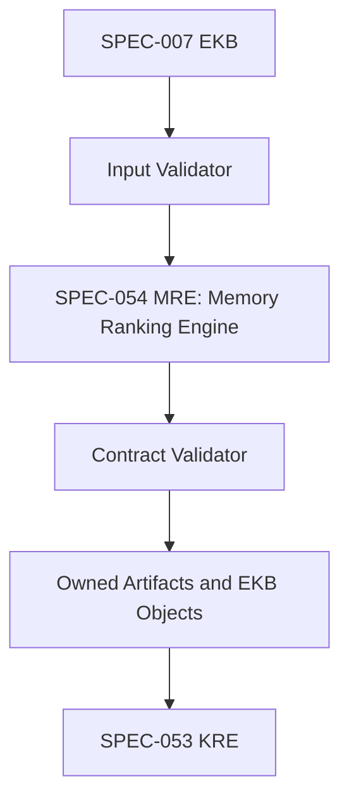

Internal component diagram:
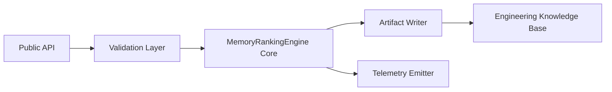

Sequence diagram:
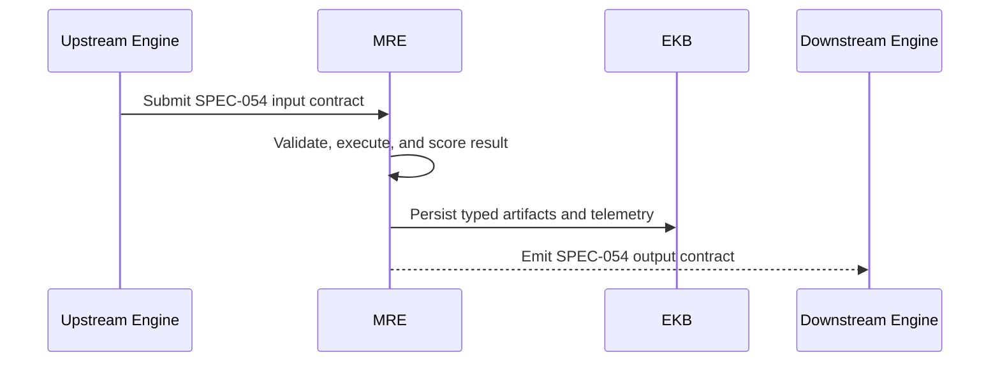

State machine:
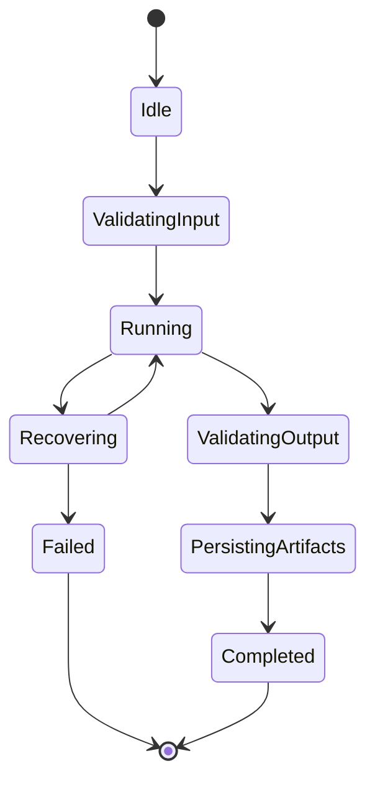

Data flow diagram:
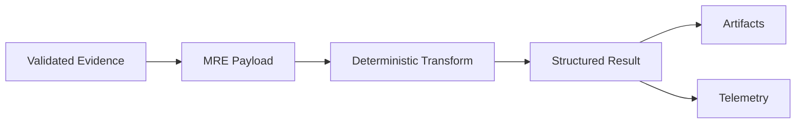

Dependency graph:
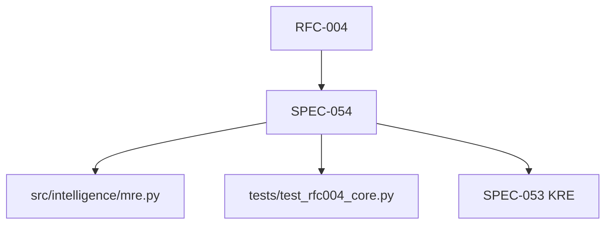

Execution pipeline:


Error recovery flow:
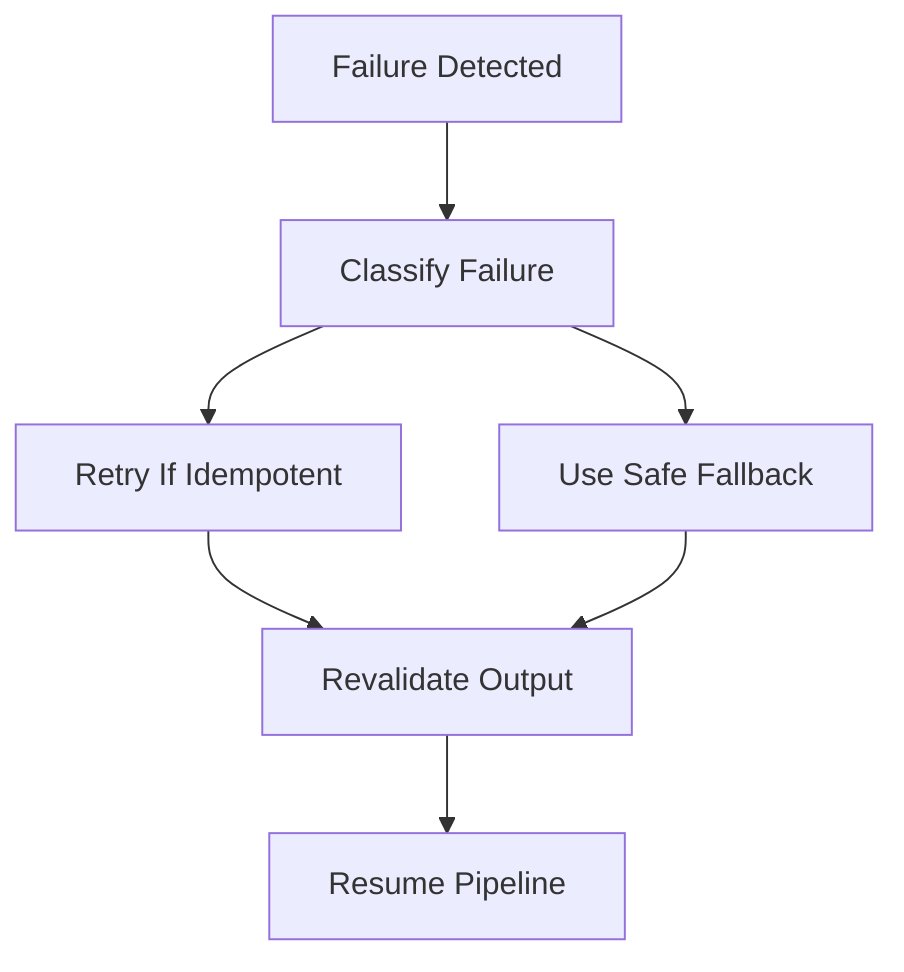

======================================================================
48. PLANTUML DIAGRAMS
======================================================================
High-level architecture:
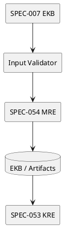

Class diagram:
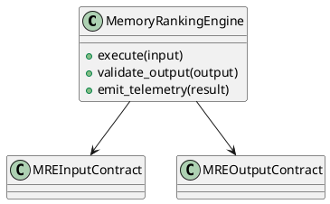

Sequence diagram:
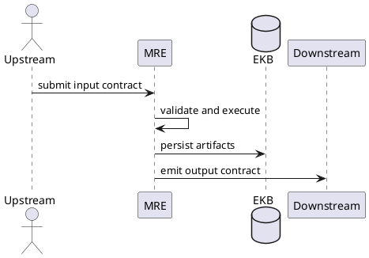

State machine:
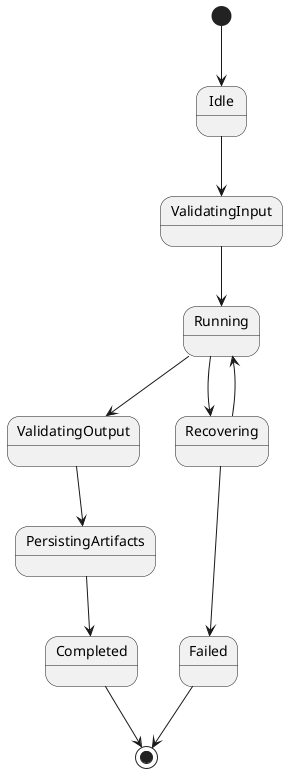

Error recovery flow:
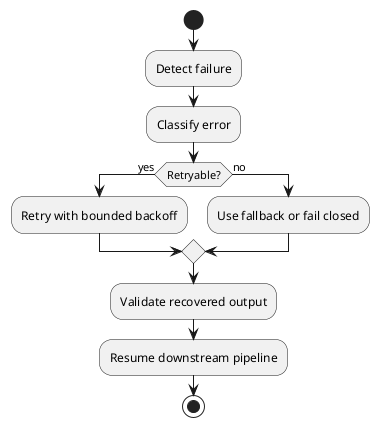

======================================================================
49. REFERENCES
======================================================================
- `00_SYSTEM_CONSTITUTION.md`
- `rfcs/RFC-004`
- `src/intelligence/mre.py`
- `tests/test_rfc004_core.py`
- `rfcs/SPEC-047-MIE.md` as the canonical enterprise standard
- Aetheris EKB, telemetry, execution, and planning artifacts under `.aetheris/`

