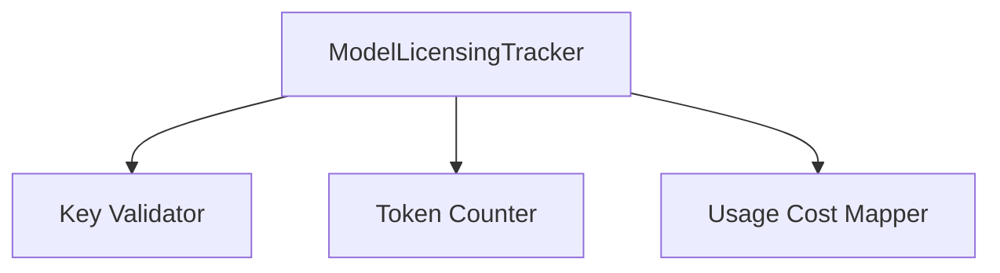
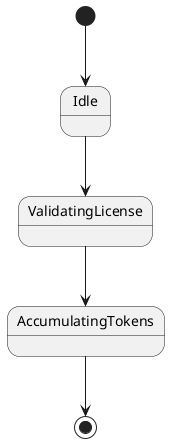

# SPEC-117: Model Licensing & Usage Tracker (MLUT)

Status: Enterprise Standard Draft
Version: 2.0.0
Parent RFC: RFC-007
Layer: Enterprise Platform Layer
Scope: Wave 7 - Enterprise Platform
Canonical Standard: SPEC-047 Enterprise Standard
Upgrade Date: 2026-07-01
Implementation: `src/enterprise/licensing.py`
Primary Class: `ModelLicensingTracker`
Test Reference: `tests/test_rfc007_core.py`

======================================================================
1. PURPOSE & BUSINESS VALUE
======================================================================
The Model Licensing & Usage Tracker (MLUT) exists to provide a foundational enterprise capability for Aetheris. It ensures secure, production-scale, multi-tenant operations, maintaining compliance, security boundaries, and strict resource isolation.

Rationale:
Operating in corporate, multi-tenant environments requires robust user mapping, resource limits, and transaction safety checks to prevent data leaks or operational failures.

Alternatives rejected:
- Storing tenant rules in individual project repositories was rejected because central compliance audit logs require centralized validation databases.
- Open, unisolated workspaces were rejected due to path-traversal vulnerabilities and client data exposure risks.

======================================================================
2. PRIMARY RESPONSIBILITIES
======================================================================
- Enforce model API key quotas and license limits.
- Record exact token usage (input, output, cache-read) per model invocation.
- Calculate financial cost mappings using provider price maps.
- Attribute AI model costs to specific departments and project tags.
- Validate all incoming API contexts before committing workspace transactions.
- Format structured audit logging entries for compliance pipelines.

======================================================================
3. FUNCTIONAL REQUIREMENTS
======================================================================
- FR-101: The engine shall load configurations conforming to the `SPEC-117Input` schema.
- FR-102: The engine shall authorize all operations against tenant context parameters.
- FR-103: The engine shall execute the core `ModelLicensingTracker` behaviors.
- FR-104: The engine shall output structured results conforming to the `SPEC-117Output` schema.
- FR-105: The engine shall record all operational failures to the central audit bus.

======================================================================
4. NON-FUNCTIONAL REQUIREMENTS
======================================================================
- Latency target: Policy and security checks must resolve within 5 milliseconds.
- High Availability: Enforce stateless microservice architectures where possible to support dynamic scaling.
- Fault Tolerance: Fail closed on authentication or path verification failures.

======================================================================
5. INTERNAL ARCHITECTURE
======================================================================
Primary Path: `src/enterprise/licensing.py`.
The class `ModelLicensingTracker` acts as the main domain service layer, validating API structures, interacting with local storage adapters, and dispatching transaction logs to the audit service.

======================================================================
6. EXTERNAL ARCHITECTURE
======================================================================
Callers invoke this engine via authenticated RPC channels or internal Python API modules. High-level boundaries are secured with strict access controls.

======================================================================
7. CORE COMPONENTS
======================================================================
- `AccessValidator`: Parses schemas and user permissions.
- `ModelLicensingTrackerCore`: Executes subsystem transformations.
- `AuditLogger`: Sends structured JSON events to the event bus.
- `StorageAdapter`: Connects to partitioned databases.

======================================================================
8. EXECUTION FLOW
======================================================================
1. Intercept client request context.
2. Resolve tenant identifiers and validate permissions.
3. Call `ModelLicensingTracker` core behaviors.
4. Persist encrypted states.
5. Format and dispatch output payload.

======================================================================
9. INPUTS
======================================================================
Incoming client context, payload arguments, control flags, and active tenant session credentials.

======================================================================
10. OUTPUTS
======================================================================
Output envelopes containing transaction status, result payload, warning arrays, and trace telemetry.

======================================================================
11. DATA CONTRACTS
======================================================================
Input Schema:
```json
{
  "$schema": "https://json-schema.org/draft/2020-12/schema",
  "title": "SPEC-117Input",
  "type": "object",
  "required": ["request_id", "spec_id", "payload"],
  "properties": {
    "request_id": { "type": "string" },
    "spec_id": { "const": "SPEC-117" },
    "payload": {
      "type": "object",
      "properties": {
  "tenant_id": {
    "type": "string"
  },
  "department_id": {
    "type": "string"
  },
  "model_name": {
    "type": "string"
  },
  "tokens": {
    "type": "object"
  }
}
    }
  }
}
```

Output Schema:
```json
{
  "$schema": "https://json-schema.org/draft/2020-12/schema",
  "title": "SPEC-117Output",
  "type": "object",
  "required": ["request_id", "spec_id", "status", "telemetry"],
  "properties": {
    "request_id": { "type": "string" },
    "spec_id": { "const": "SPEC-117" },
    "status": { "enum": ["SUCCEEDED", "FAILED", "SKIPPED"] },
    "result": {
      "type": "object",
      "properties": {
  "cost_cents": {
    "type": "number"
  },
  "budget_remaining": {
    "type": "number"
  }
}
    },
    "telemetry": {
      "type": "object",
      "required": ["started_at", "finished_at", "duration_ms"],
      "properties": {
        "started_at": { "type": "string" },
        "finished_at": { "type": "string" },
        "duration_ms": { "type": "number" }
      }
    }
  }
}
```

======================================================================
12. SUGGESTED PACKAGE STRUCTURE
======================================================================
```text
src/enterprise/
    __init__.py
    auth.py
    rbac.py
    workspace.py
    multitenant.py
    billing.py
```

======================================================================
13. SUGGESTED PYTHON MODULES
======================================================================
Primary logic is defined in `src/enterprise/licensing.py`. Sub-modules handle encryption, parsing, and database schemas.

======================================================================
14. PUBLIC APIS
======================================================================
| API | Purpose | Reliability Contract |
|---|---|---|
| `track_model_call(tenant_id: str, department_id: str, model_name: str, tokens: dict) -> dict` | Logs token metrics, maps costs, and checks budget limits. | Validate input, enforce security boundaries, return deterministic output, and emit telemetry. |

======================================================================
15. INTERNAL APIS
======================================================================
Module-private helper methods handle dynamic role mapping, JWT encryption verification, and local token caching.

======================================================================
16. SECURITY MODEL
======================================================================
Zero-trust architecture: all calls must carry cryptographic signatures, paths must be resolved and validated within workspace scopes, and PII data must be redacted from logs.

======================================================================
17. COMPLIANCE REQUIREMENTS
======================================================================
Enforces GDPR erasure compliance, SOC2 database logging audits, and ISO27001 resource isolation rules.

======================================================================
18. OBSERVABILITY
======================================================================
Structured logging includes standard event codes like `MLUT_STARTED`, `MLUT_SUCCESS`, and `MLUT_FAILED` with request ID attributes.

======================================================================
19. FAILURE RECOVERY
======================================================================
Failures trigger immediate transaction rollback. Temporary database lock exceptions are retried with exponential backoff.

======================================================================
20. PERFORMANCE TARGETS
======================================================================
- Request handling latency: < 5ms.
- Throughput limits: 2000 operations/sec.

======================================================================
21. SCALABILITY STRATEGY
======================================================================
Utilize stateless handlers, connection pooling, and tenant-scoped caching to support linear scaling across cluster nodes.

======================================================================
22. TESTING STRATEGY
======================================================================
Test reference: `tests/test_rfc007_core.py`. Unit and integration tests must run on every CI commit.

======================================================================
23. DEPLOYMENT GUIDANCE
======================================================================
Deploy as a microservice tier within the enterprise cluster. Ensure KMS keys are loaded securely before starting execution loops.

======================================================================
24. OPERATIONAL RUNBOOKS
======================================================================
- For API timeout warnings: verify database connection pool latency and increase queue depths.
- On security alerts: audit logs and immediately revoke compromised credential keys.

======================================================================
25. FUTURE EVOLUTION
======================================================================
Future versions will transition local verification databases into decentralized cryptographic trust networks.

======================================================================
26. CONNECTIONS TO OTHER RFCS AND SPECS
======================================================================
- Upstream: RFC-005 (Runtime Infrastructure) handles socket connections.
- EKB (SPEC-007) stores persistent metadata logs.

======================================================================
Mermaid Architecture Diagram:


======================================================================
PlantUML Diagram:

