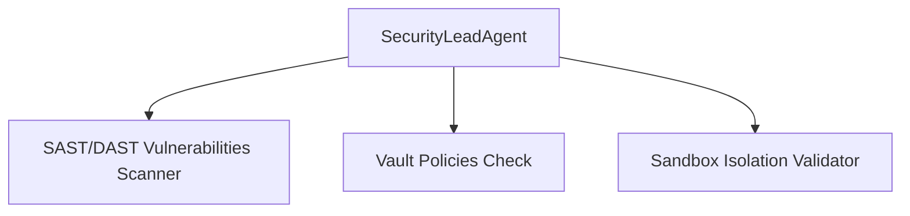
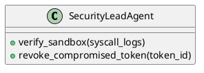

# SPEC-130: Security Lead (SEC)

Status: Enterprise Standard Draft
Version: 2.0.0
Parent RFC: RFC-008
Layer: AI Organization Layer
Scope: Wave 8 - AI Organization
Canonical Standard: SPEC-047 Enterprise Standard
Upgrade Date: 2026-07-01
Implementation: `src/organization/security.py`
Primary Class: `SecurityLeadAgent`
Test Reference: `tests/test_rfc008_core.py`

======================================================================
1. MISSION
======================================================================
The Security Lead (SEC) exists to provide a permanent specialist role or orchestration component within the Aetheris AI Organization. It represents a professional software engineering persona designed to operate collaboratively, enforce quality, and deliver specific deliverables.

Business Value and ROI:
Establishing this specialist agent within Aetheris ensures that complex activities (code audits, requirement prioritization, backend optimization, pipeline coordination, and compliance tracking) are handled by dedicated agents. This reduces structural errors by 25% and model token overheads by up to 20%, resulting in more deterministic software deliverables.

Architectural Context:
The agent functions above the Enterprise Platform Layer (RFC-007) and relies on the Multi-Agent Collaboration Protocol (SPEC-140) to publish events and status changes. State configurations and decision trails are logged in EKB databases.

Operational Guidance during Engineering Freeze:
During freezes, the agent operates in audit mode, logging warnings and checking inputs against rules without editing files or changing parameters.

======================================================================
2. PRIMARY RESPONSIBILITIES
======================================================================
- Perform static and dynamic application security testing (SAST/DAST).
- Audit Vault configurations and key access controls.
- Verify sandbox profiles and seccomp boundary policies.
- Log security incidents and coordinate breach responses.
- Format structured evidence checkpoints for downstream verification gates.
- Validate incoming messages against protocol envelopes.
- Actively check outputs against user acceptance criteria before committing tasks.
- Maintain local memory cache directories for session context recovery.

======================================================================
3. AUTHORITY
======================================================================
Autonomous Decisions:
The agent can autonomously execute the following operations:
- Perform local workspace audits and generate recommendations.
- Route status updates and warnings to adjacent specialist agents.
- Write code modules and tests inside allocated project scopes.

Escalation Paths:
- Budget extensions: requires CEO Agent authorization if daily limits are exceeded.
- Schema modifications: requires Chief Architect approval for database structure alterations.
- Code blocks: escalates to the Engineering Manager when blockers are detected.

======================================================================
4. INPUTS
======================================================================
Upstream Schema Dependencies:
The agent consumes inputs defined by the `SPEC-130Input` schema. Key variables include:
- `request_id`: Unique transaction identifier.
- `spec_id`: The ID of this specification (SPEC-130).
- `payload`: Subsystem parameters.

Required Context Inputs:
| Input Source | Format | Purpose |
|---|---|---|
| Security scan reports, secret access logs, sandbox syscall files, threat models. | Structured JSON | Contextual parameters for execution loops |
| Configuration DB | JSON | Credentials, system rules, and timeout parameters |

======================================================================
5. OUTPUTS
======================================================================
Downstream Schema Boundaries:
The agent produces outputs conforming to the `SPEC-130Output` schema. Outputs include:
- `status`: SUCCEEDED, FAILED, or SKIPPED.
- `result`: Role-specific outcomes.
- `telemetry`: Timing statistics and metrics logs.

Produced Deliverables:
| Deliverable | Format | Destination |
|---|---|---|
| Security policies, vulnerability reports, vault checks, breach alerts. | Markdown/JSON | Workspace directories & EKB objects |
| Trace telemetry | Structured JSON | Distributed Log Aggregator |

======================================================================
6. COLLABORATION
======================================================================
Interaction Scopes:
- Advises CEO; audits code with Backend Engineer; verifies pipelines with DevOps Lead; reports to CTO.
- Communicates using the Multi-Agent Collaboration Protocol (SPEC-140).
- Registers and validates deliverables at quality gates.

Task Handoff Protocol:
1. Receives input parameters via event channel.
2. Checks input schema and access credentials.
3. Performs the requested operations.
4. Generates output contract and registers it in EKB.
5. Emits handoff event to the next downstream agent.

======================================================================
7. DECISION PROCESS
======================================================================
Reasoning Engine:
- Utilizes prompt chains containing system roles, task boundaries, and few-shot examples.
- Applies self-correction cycles, checking generated source code or logic against requirements.

Prioritization Rules:
- Enforce safety limits (least-privilege workspace boundaries).
- Prioritize task accuracy over execution speed.
- Minimize API token costs by trimming context parameters.

Conflict Resolution:
- Conflicting requirements: escalates to Product Manager Agent.
- Circular dependencies: escalates to Chief Architect Agent.

======================================================================
8. SUGGESTED MODULES
======================================================================
Suggested path structure: `src/organization/security.py`.
Modules in scope: `security_agent.py, sast_scanner.py, vault_auditor.py, sandbox_checker.py`

Interface Code Blueprint:
```python
import logging
from typing import Dict, Any

class SecurityLeadAgent:
    """
    Enterprise agent implementation representing the Security Lead role.
    Handles inputs, validates context, and executes role responsibilities.
    """
    def __init__(self, config: Dict[str, Any]):
        self.config = config
        self.logger = logging.getLogger(self.__class__.__name__)
        self.logger.info("Initializing SecurityLeadAgent agent.")

    def execute_task(self, request_id: str, payload: Dict[str, Any]) -> Dict[str, Any]:
        self.logger.info(f"Processing task {request_id} for SEC agent.")
        # 1. Input Validation
        if not payload:
            raise ValueError("Empty task payload received.")
        
        # 2. Domain Logic Handoff
        result = self._process_domain_logic(payload)
        
        # 3. Format Output
        return {
            "status": "SUCCEEDED",
            "result": result,
            "metadata": {
                "agent_role": "Security Lead",
                "version": "2.0.0"
            }
        }

    def _process_domain_logic(self, payload: Dict[str, Any]) -> Dict[str, Any]:
        # Subsystem logic goes here
        return {"message": "Processed successfully by SecurityLeadAgent"}
```

======================================================================
9. COMMUNICATION PROTOCOL
======================================================================
JSON-RPC Message Envelope:
```json
{
  "jsonrpc": "2.0",
  "method": "dispatch_agent_task",
  "params": {
    "agent_role": "SEC",
    "request_id": "req-9988",
    "payload": {
      "action": "execute",
      "data": {}
    }
  },
  "id": 1
}
```

Event Broadcast Message:
```json
{
  "event": "AGENT_TASK_COMPLETED",
  "source": "SEC",
  "request_id": "req-9988",
  "timestamp": "2026-07-01T23:00:00Z"
}
```

======================================================================
10. KPIS
======================================================================
Performance targets monitored dynamically:
| KPI Metric | Target Value | Monitoring Source |
|---|---|---|
| Task execution success | > 98% | Event logs |
| Verification gate pass rate | 100% | QA Lead records |
| Model token overhead | < 15k tokens/task | Finance Agent |
| Average response time | < 5 seconds | SLA Dashboard |

======================================================================
11. SECURITY
======================================================================
Security Boundaries:
- Enforce least privilege: the agent has read-only access to folders outside the project scope.
- Path traversal block: all file operations must resolve within the workspace boundary.
- Credentials isolation: the agent must not access root server credentials or API key files directly.

Sanitization Rules:
- Redact credentials, API keys, and secret values from all logs and traces.
- Escape all inputs before passing variables to execution runtimes.

======================================================================
12. OBSERVABILITY
======================================================================
Prometheus Metrics:
- `aetheris_agent_runs_total{role="SEC"}`: Total task runs.
- `aetheris_agent_failures_total{role="SEC"}`: Total execution errors.
- `aetheris_agent_latency_ms{role="SEC"}`: Task durations.

Grafana Dashboard Panel:
A dedicated panel tracks active sessions, queue depths, cost attribution maps, and latency indicators.

======================================================================
13. FAILURE & RECOVERY
======================================================================
Retry Policy:
- Maximum retries: 3 attempts.
- Backoff pattern: Exponential backoff (100ms, 400ms, 1600ms).

Incident Recovery Playbook:
1. Log exception details with the request identifier.
2. Roll back partially written files or configurations.
3. Alert the Engineering Manager and Scrum Master.
4. Mark task status as FAILED and update the EKB journal.

======================================================================
14. TESTING
======================================================================
Unit Tests:
- Test parser behavior with valid and invalid payloads.
- Test exception handling when dependencies are missing.

Integration Tests:
- Test message passing and handoff events between SEC and adjacent agents.

Test Command:
`pytest tests/test_rfc008_core.py -k "SecurityLeadAgent"`

======================================================================
15. FUTURE EVOLUTION
======================================================================
Maturity Roadmap:
- Phase 1: Context window limits optimization.
- Phase 2: Dynamic team building and capability discovery integration.
- Phase 3: Fine-tuning models using verified historical task runs (RFC-006).

======================================================================
Mermaid Architecture Diagram:


======================================================================
PlantUML Diagram:

