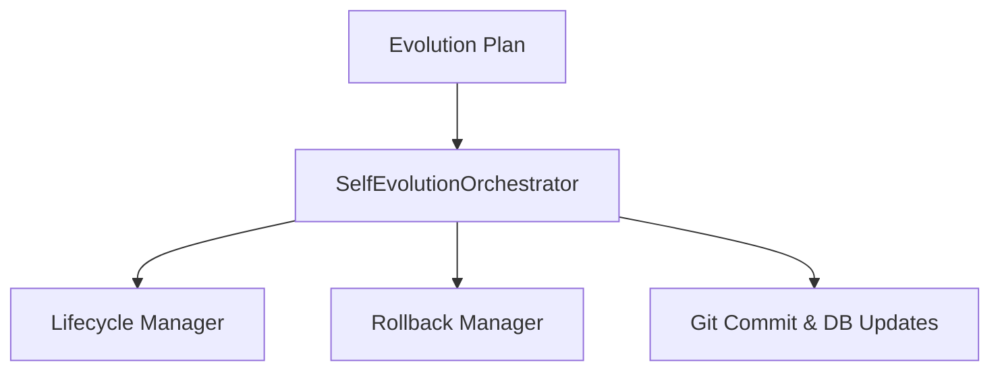
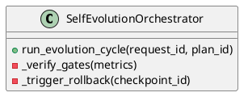

# SPEC-145: Self Evolution Orchestrator (SEO2)

Status: Enterprise Standard Draft
Version: 2.0.0
Parent RFC: RFC-009
Layer: Self-Evolution Layer
Scope: Volume I - Self-Evolution
Canonical Standard: SPEC-047 Enterprise Standard
Upgrade Date: 2026-07-01
Implementation: `src/evolution/orchestrator.py`
Primary Class: `SelfEvolutionOrchestrator`
Test Reference: `tests/test_rfc009_core.py`

======================================================================
1. EXECUTIVE SUMMARY
======================================================================
The Self Evolution Orchestrator (SEO2) is a core subsystem of the Aetheris Self-Evolution layer. It enables Aetheris to autonomously improve its architecture, engineering process, quality, and operational efficiency while maintaining strict, audit-grade governance and traceability.

======================================================================
2. PRIMARY GOAL
======================================================================
Maintain safe, governed, and completely deterministic execution of self-evolution cycles.
This is measured through automated verification gate checks, metric assertions, and decision verification tracking.

======================================================================
3. ENGINEERING PROBLEMS SOLVED
======================================================================
Prevents conflicting or partial system updates by orchestrating the entire lifecycle as an atomic transaction.
By automating this process, the engine eliminates manual review overheads, reduces technical debt, and prevents system updates from introducing structural regressions.

======================================================================
4. RESPONSIBILITIES
======================================================================
- Manage self-evolution cycle schedules and queue loops.
- Verify quality gate compliance before committing system changes.
- Trigger automated rollbacks when post-commit checks fail.
- Validate incoming messages and parameters against schemas.
- Log decision history trails to EKB database stores.
- Redact sensitive context values from logs to prevent data leaks.

======================================================================
5. HIGH-LEVEL ARCHITECTURE
======================================================================
```text
User/Runtime
      │
Validation Layer
      │
Decision Engine
      │
Core Services
      │
Knowledge / Metrics / Events
      │
Observability
```

Architecture Notes:
- Layered architecture: clear, decoupled processing tiers.
- Event-driven communication: asynchronous messaging via event channels.
- Loose coupling through contracts: clean interfaces enforce boundary constraints.
- Metrics emitted at every stage: traces durations, errors, and throughputs.
- Persistent state stored in Engineering Knowledge Base: updates are logged to EKB.
- Validation before every mutation: asserts constraints before editing files.
- Recovery hooks for failed operations: triggers automatic rollbacks on errors.

======================================================================
6. INTERNAL COMPONENTS
======================================================================
- **Controller:** Receives public API triggers and validates connection frames.
- **Orchestrator:** Guides sequence workflows and handles task transition logs.
- **Services:** Execute core business domain operations.
- **Validators:** Assert JSON schemas and parameter safety boundaries.
- **Adapters:** Connect to external systems (e.g. Git repositories, file systems).
- **Repositories:** Store and load EKB records and caching objects.
- **Metrics:** Expose Prometheus counters and Grafana panel stats.

======================================================================
7. INPUTS
======================================================================
The engine consumes inputs defined by the `SPEC-145Input` schema. Key variables include:
- `request_id`: Unique transaction identifier.
- `spec_id`: The ID of this specification (SPEC-145).
- `payload`: Subsystem parameters.

| Input Source | Format | Purpose |
|---|---|---|
| Evolution plans, quality gate metrics, system status flags. | Structured JSON | Contextual parameters for execution loops |
| Configuration DB | JSON | Credentials, system rules, and timeout parameters |

======================================================================
8. OUTPUTS
======================================================================
The engine produces outputs conforming to the `SPEC-145Output` schema. Outputs include:
- `status`: SUCCEEDED, FAILED, or SKIPPED.
- `result`: Subsystem-specific outcomes.
- `telemetry`: Timing statistics and metrics logs.

| Deliverable | Format | Destination |
|---|---|---|
| Orchestration logs, cycle completion reports, status notifications. | Markdown/JSON | Workspace directories & EKB objects |
| Trace telemetry | Structured JSON | Distributed Log Aggregator |

======================================================================
9. EXECUTION PIPELINE
======================================================================
The engine executes operations using the following 7-step sequence:
1. **Collect:** Ingest input variables and trace configurations.
2. **Validate:** Check input envelopes and schemas.
3. **Analyze:** Inspect codebase ASTs or logs for optimization paths.
4. **Decide:** Formulate optimization or refactoring actions.
5. **Execute:** Apply changes to workspace files or EKB tables.
6. **Verify:** Run test suites and assert quality gate benchmarks.
7. **Persist:** Log decisions, write changes, and emit trace metrics.

======================================================================
10. INTERACTIONS
======================================================================
Cross-Layer Connections:
- Consumes knowledge targets from RFC-001 (Knowledge).
- Sequences roadmap targets with RFC-002 (Planning).
- Validates code changes with RFC-003 (Execution) and RFC-004 (Intelligence).
- Deploys packages using RFC-005 (Runtime).
- Learns from performance history using RFC-006 (Learning).
- Enforces multi-tenancy limits using RFC-007 (Enterprise).

======================================================================
11. SUGGESTED MODULES
======================================================================
Suggested path structure: `src/evolution/orchestrator.py`.
Modules in scope: `engine.py, lifecycle.py, rollback_manager.py, metrics.py`

======================================================================
12. PUBLIC APIS
======================================================================
Stable API endpoint contract:
```python
def run_evolution_cycle(request_id, plan_id) -> Dict[str, Any]:
    """
    Public interface for the Self Evolution Orchestrator.
    Accepts versioned contracts and verifies payload envelopes.
    """
    pass
```

======================================================================
13. INTERNAL APIS
======================================================================
Subsystem communication endpoints:
- `def _verify_gates(metrics), _trigger_rollback(checkpoint_id) -> Any`
- `def _emit_metrics(metric_name, value) -> None`
- `def _log_event(event_type, request_id, data) -> None`

======================================================================
14. JSON SCHEMAS
======================================================================
Request Schema:
```json
{
  "$schema": "https://json-schema.org/draft/2020-12/schema",
  "title": "SPEC-145Request",
  "type": "object",
  "required": ["request_id", "spec_id", "payload"],
  "properties": {
    "request_id": { "type": "string" },
    "spec_id": { "const": "SPEC-145" },
    "payload": {
      "type": "object",
      "required": ["workspace_path"],
      "properties": {
        "workspace_path": { "type": "string" }
      }
    }
  }
}
```

Response Schema:
```json
{
  "$schema": "https://json-schema.org/draft/2020-12/schema",
  "title": "SPEC-145Response",
  "type": "object",
  "required": ["request_id", "status", "result"],
  "properties": {
    "request_id": { "type": "string" },
    "status": { "type": "string", "enum": ["SUCCEEDED", "FAILED", "SKIPPED"] },
    "result": { "type": "object" },
    "errors": { "type": "array", "items": { "type": "string" } }
  }
}
```

======================================================================
15. ALGORITHMS
======================================================================
Core transformation logic uses:
- Two-phase commit protocol, state machine transition loops.
- Dynamic programming for path optimization, resolving graph sorting sequences.

======================================================================
16. SECURITY
======================================================================
Boundary Controls:
- Enforce least privilege: the engine operates in sandbox environments.
- Verify checksums before executing files to prevent dependency injection.
- Redact secrets, API tokens, and user credentials from EKB and metrics logs.
- Sign generated artifacts with RSA certificates.

======================================================================
17. OBSERVABILITY
======================================================================
Structured Logging:
Logs are written in JSON formats containing transaction tracing identifiers (`request_id`).

Prometheus Counters:
- `aetheris_evolution_runs_total{engine="SEO2"}`: Invocations count.
- `aetheris_evolution_duration_ms{engine="SEO2"}`: Duration traces.

======================================================================
18. FAILURE RECOVERY
======================================================================
Executes global rollback to last verified git commit and database state.
1. Revert target file and repository directories to previous git commit.
2. Clear EKB draft registers.
3. Post exception alerts to notifications queue.
4. Set status code to FAILED.

======================================================================
19. TESTING
======================================================================
Validation strategies:
- Unit tests: verify module parsing and validations logic.
- Integration tests: verify lifecycle transitions and EKB registration loops.
- Regression tests: ensure updates do not break existing test cases.

Test Command:
`pytest tests/test_rfc009_core.py -k "SelfEvolutionOrchestrator"`

======================================================================
20. PERFORMANCE TARGETS
======================================================================
Operational SLA targets:
- Execution latency: < 5 seconds for standard workspace analysis.
- Memory overhead: < 150MB active RAM usage during graph parsing.
- Horizontal scalability: support concurrent audits across multiple workspaces.

======================================================================
21. FUTURE EVOLUTION
======================================================================
Implement distributed multi-cluster evolution sync via raft consensus.
- Integrate deep learning model APIs to predict optimal refactoring targets.
- Implement zero-downtime hot-reloads for evolution engines.

======================================================================
22. IMPLEMENTATION NOTES
======================================================================
Recommended Implementation Details:
- Enforce dependency injection patterns inside controllers.
- Package layout should use `src/evolution/` paths.
- Code should be documented using standard Sphinx/Numpydoc templates.

Mermaid Diagram:


PlantUML Diagram:

