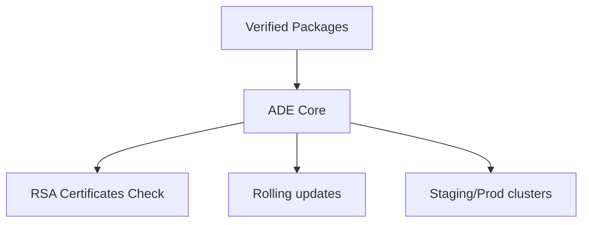
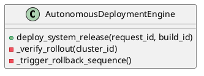

# SPEC-156: Autonomous Deployment Engine (ADE)

Status: Enterprise Standard Draft
Version: 2.0.0
Parent RFC: RFC-009
Layer: Self-Evolution Layer
Scope: Volume II - Self-Evolution
Canonical Standard: SPEC-047 Enterprise Standard
Upgrade Date: 2026-07-01
Implementation: `src/evolution/deployment.py`
Primary Class: `AutonomousDeploymentEngine`
Test Reference: `tests/test_rfc009_vol2.py`

======================================================================
1. EXECUTIVE SUMMARY
======================================================================
The Autonomous Deployment Engine (ADE) extends the Aetheris Self-Evolution layer. It enables Aetheris to autonomously improve its architecture, governance, execution, and operational capabilities through continuous observation, analysis, and controlled evolution.

======================================================================
2. BUSINESS MOTIVATION
======================================================================
Manual deployments block continuous integration pipelines and introduce operational risks. ADE automates deployment steps safely.
Automating this subsystem ensures that system upgrades, validation cycles, incident responses, and policy updates run continuously in production with zero downtime or operational risks.

======================================================================
3. GOALS
======================================================================
Achieve zero-downtime rollouts, automate checksum validations, and support atomic release rollbacks.
Measurable success criteria include complete validation coverage, automated MTTR metrics, and zero transaction leakage on version rollouts.

======================================================================
4. RESPONSIBILITIES
======================================================================
- Coordinate production package deployments across staging and production clusters.
- Verify deployment checksums and cryptographic certificates.
- Manage rolling updates across distributed clusters.
- Validate incoming messages and parameters against schemas.
- Log operational histories and metrics to EKB database stores.
- Redact sensitive keys and credential profiles from all debug streams.

======================================================================
5. HIGH-LEVEL ARCHITECTURE
======================================================================
```text
Input Sources
      │
Validation Layer
      │
Reasoning & Evolution
      │
Execution Services
      │
Knowledge / State / Metrics
      │
Observability & Audit
```

Architecture Principles:
- Event-driven coordination: scheduling loops transition states using events.
- Deterministic execution: identical input packages produce equivalent outcomes.
- Version-controlled evolution: updates are tracked via git version hashes.
- Full traceability: every update references upstream validation logs.
- Continuous validation: runs compiler checks and lints before mutations.
- Secure mutation pipeline: restricts file access using isolated container boundaries.
- Production observability: exposes logs, Prometheus metrics, and traces.

======================================================================
6. INTERNAL COMPONENTS
======================================================================
- **Controllers:** Handle API entries, validation checks, and event loops.
- **Services:** Execute core business domain operations.
- **Repositories:** Manage caching maps, database connections, and EKB records.
- **Planners:** Sequence evolution targets, scheduling loops.
- **Evaluators:** Score operational risks, budget costs, and accuracy checks.
- **Metrics:** Expose Prometheus latency and runs counters.

======================================================================
7. INPUTS
======================================================================
The engine consumes inputs defined by the `SPEC-156Input` schema. Key variables include:
- `request_id`: Unique transaction identifier.
- `spec_id`: The ID of this specification (SPEC-156).
- `payload`: Subsystem parameters.

| Input Source | Format | Purpose |
|---|---|---|
| Verified deployment packages, cluster target lists, release configurations. | Structured JSON | Contextual parameters for execution loops |
| Configuration DB | JSON | Credentials, system rules, and timeout parameters |

======================================================================
8. OUTPUTS
======================================================================
The engine produces outputs conforming to the `SPEC-156Output` schema. Outputs include:
- `status`: SUCCEEDED, FAILED, or SKIPPED.
- `result`: Subsystem-specific outcomes.
- `telemetry`: Timing statistics and metrics logs.

| Deliverable | Format | Destination |
|---|---|---|
| Deployment logs, container registry updates, rollout status reports. | Markdown/JSON | Workspace directories & EKB objects |
| Trace telemetry | Structured JSON | Distributed Log Aggregator |

======================================================================
9. EXECUTION LIFECYCLE
======================================================================
The engine executes operations using the following 6-step sequence:
1. **Observe:** Scan metrics, alerts, codebase ASTs, or logs.
2. **Analyze:** Parse files, compute risk scores, and check dependencies.
3. **Plan:** Construct refactoring plans, deployment scripts, or policy updates.
4. **Evolve:** Apply upgrades to workspace code, configs, or EKB registries.
5. **Verify:** Execute compiler tests and assert quality gate parameters.
6. **Persist:** Save upgrades, log decisions, and emit metrics.

======================================================================
10. DEPENDENCIES
======================================================================
System Boundaries:
- Consumes knowledge packages from RFC-001 (Knowledge).
- Runs task sequences via RFC-002 (Planning) and RFC-003 (Execution).
- Verifies intelligence models using RFC-004 (Intelligence).
- Deploys packages using RFC-005 (Runtime) and RFC-006 (Learning).
- Enforces access scopes using RFC-007 (Enterprise) and RFC-008 (AI Organization).

======================================================================
11. SUGGESTED MODULES
======================================================================
Suggested path structure: `src/evolution/deployment.py`.
Modules in scope: `engine.py, deployment_coordinator.py, rollout_validator.py, metrics.py`

======================================================================
12. PUBLIC APIS
======================================================================
Stable API endpoint contract:
```python
def deploy_system_release(request_id, build_id) -> Dict[str, Any]:
    """
    Public interface for the Autonomous Deployment Engine.
    Accepts versioned contracts and verifies payload envelopes.
    """
    pass
```

======================================================================
13. INTERNAL APIS
======================================================================
Subsystem communication endpoints:
- `def _verify_rollout(cluster_id), _trigger_rollback_sequence() -> Any`
- `def _emit_metrics(metric_name, value) -> None`
- `def _log_event(event_type, request_id, data) -> None`

======================================================================
14. DATA SCHEMAS
======================================================================
Request Schema:
```json
{
  "$schema": "https://json-schema.org/draft/2020-12/schema",
  "title": "SPEC-156Request",
  "type": "object",
  "required": ["request_id", "spec_id", "payload"],
  "properties": {
    "request_id": { "type": "string" },
    "spec_id": { "const": "SPEC-156" },
    "payload": {
      "type": "object",
      "required": ["workspace_path"],
      "properties": {
        "workspace_path": { "type": "string" }
      }
    }
  }
}
```

Response Schema:
```json
{
  "$schema": "https://json-schema.org/draft/2020-12/schema",
  "title": "SPEC-156Response",
  "type": "object",
  "required": ["request_id", "status", "result"],
  "properties": {
    "request_id": { "type": "string" },
    "status": { "type": "string", "enum": ["SUCCEEDED", "FAILED", "SKIPPED"] },
    "result": { "type": "object" },
    "errors": { "type": "array", "items": { "type": "string" } }
  }
}
```

======================================================================
15. ALGORITHMS
======================================================================
Core transformation logic uses:
- Rolling update scheduling, consensus validation on nodes, checksum verification.
- Priority queue scheduling for task execution, sequencing dependencies graph.

======================================================================
16. SECURITY
======================================================================
Boundary Controls:
- Enforce least privilege: the engine runs inside container sandboxes.
- Cryptographic signature validation: check package checksums before deployment.
- Redact secrets, API credentials, and billing keys from metrics logs.
- Sign generated artifacts with RSA certificates.

======================================================================
17. OBSERVABILITY
======================================================================
Structured Logging:
Logs are written in JSON formats containing transaction tracing identifiers (`request_id`).

Prometheus Counters:
- `aetheris_evolution_runs_total{engine="ADE"}`: Invocations count.
- `aetheris_evolution_duration_ms{engine="ADE"}`: Duration traces.

======================================================================
18. FAILURE RECOVERY
======================================================================
Reverts active containers to last verified stable image tag; logs rollout failure details.
1. Revert target file and container registries to last verified commit.
2. Clear active queues and EKB draft tables.
3. Route warning alerts to notification dispatcher.
4. Set status code to FAILED.

======================================================================
19. TESTING
======================================================================
Validation strategies:
- Unit tests: verify module parsing and validations logic.
- Integration tests: verify lifecycle transitions and EKB registration loops.
- Regression tests: ensure updates do not break existing test cases.

Test Command:
`pytest tests/test_rfc009_vol2.py -k "AutonomousDeploymentEngine"`

======================================================================
20. PERFORMANCE TARGETS
======================================================================
Operational SLA targets:
- Execution latency: < 5 seconds for standard workspace analysis.
- Memory overhead: < 150MB active RAM usage during graph parsing.
- Horizontal scalability: support concurrent audits across multiple workspaces.

======================================================================
21. FUTURE EVOLUTION
======================================================================
Deploy blockchain-based release registry sync loops across federated nodes.
- Deploy reinforcement learning agents to dynamically tune database buffer allocations.
- Implement zero-downtime hot-reloads for evolution engines.

======================================================================
22. IMPLEMENTATION GUIDANCE
======================================================================
Recommended Implementation Details:
- Enforce dependency injection patterns inside controllers.
- Package layout should use `src/evolution/` paths.
- Code should be documented using standard Sphinx/Numpydoc templates.

Mermaid Diagram:


PlantUML Diagram:

